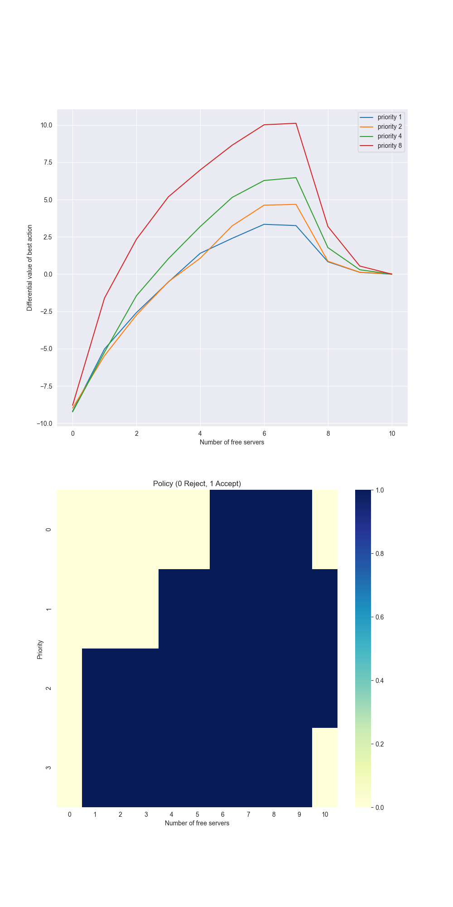

# **Reinforcement Learning: Access Control**

This project implements **Differential Semi-gradient Sarsa** with **Tile Coding** to solve the **Access Control Queuing Task**, a continuing reinforcement learning problem.  
It reproduces the experiment from **Chapter 10 — Function Approximation** of *Reinforcement Learning: An Introduction* by **Richard S. Sutton & Andrew G. Barto**.

---

## **📂 Project Structure**
```
access-control/
├── book_images/ # Reference plots from the Sutton & Barto book
│ ├── Figure_10_5_1.PNG
│ └─── Figure_10_5_2.PNG
├── generated_images/ # Plots produced from simulation
│ └── figure_10_5.png
├── notebooks/
│ └── access_control.ipynb # Experiment notebook
├── src/
│ ├── access_control.py # Environment + Differential Semi-gradient Sarsa logic
│ └── tile_coding.py # Tile-coding implementation
└── README.md # Project documentation
```

---

## ✅ Key Features
- Implements **Differential Semi-gradient Sarsa** for a **continuing-task** control problem
- Uses **Tile Coding** to approximate the differential state–action value
- Learns **average reward per time-step** directly without discounting
- Includes frequency analysis of server utilization

---

## 🧩 Problem Description

The **Access-Control Queuing Task** models a system with a fixed number of servers.  
At each time-step a customer arrives with a certain **priority**.  
The agent must decide whether to **accept** or **reject** the request.

| Component | Description |
|------------|-------------|
| **State** | `(number of free servers, priority)` |
| **Actions** | `{reject = 0, accept = 1}` |
| **Reward** | If accepted → `2^priority`, otherwise `0` |
| **Transition** | Accepted → server count decreases; each busy server becomes free with probability 0.06 |
| **Average Reward Goal** | Maximize expected reward per step over the continuing process |

---

## ⚙️ Function Approximation with Tile Coding

Because the state–action space is discrete but large and continuous-like,  
the **state–action value function** \( q(s,a) \) is approximated with tile coding:

$$
q(s, a) ≈ \sum_{i ∈ \text{active tiles}(s,a)} w_i
$$

Each tile encodes both the **number of free servers** and the **priority**, scaled by:

- **Server scale:** `num_of_tilings / number_of_servers`
- **Priority scale:** `num_of_tilings / (number_of_priorities − 1)`

The implementation uses an **Index Hash Table (IHT)** to manage collisions, following Sutton’s reference tile-coding utilities.

---

## 🔄 Differential Semi-gradient Sarsa

The algorithm updates both the **weights** and the **average reward** estimate \( \bar{r} \):

$$
\delta = R_t - \bar{r} + q(S_{t+1}, A_{t+1}) - q(S_t, A_t)
$$
$$
\bar{r} ← \bar{r} + β \delta
$$
$$
\mathbf{w} ← \mathbf{w} + α \delta \nabla q(S_t, A_t)
$$

Where:
- \( α \) = step size for state–action values
- \( β \) = step size for average reward
- \( ε \) = exploration probability (ε-greedy policy)

The **continuing** nature of the task means there is **no terminal state**; learning proceeds indefinitely.

---

## 📊 Results
### Figure 10_5 — Average Reward and Policy Pattern


Learned policy and average reward estimates across server states

The reproduced curve matches Sutton & Barto’s **Figure 10.5**, showing optimal behavior:
- High-priority customers are accepted more often
- Low-priority customers are only accepted when servers are abundant

---

## 🔍 Key Observations
- **Tile Coding** generalizes effectively between similar server and priority states.
- **Differential learning** enables stable average-reward optimization without discounting.
- Learned policies demonstrate **threshold-like behavior**: only high-priority requests are accepted when servers are scarce.
- The learned average reward stabilizes as the system converges to efficient resource allocation.

---

## 🏁 Conclusion

This implementation demonstrates how **differential methods** can learn **average reward** policies in **continuing tasks** using **function approximation**.  
It faithfully reproduces the **Access-Control Queuing Task** from **Example 10.2** in Sutton & Barto and serves as a solid reference for:

- Comparing **average-reward vs discounted** approaches
- Extending to other continuing domains (e.g., manufacturing, network allocation)
- Exploring actor–critic versions of average-reward algorithms

---
