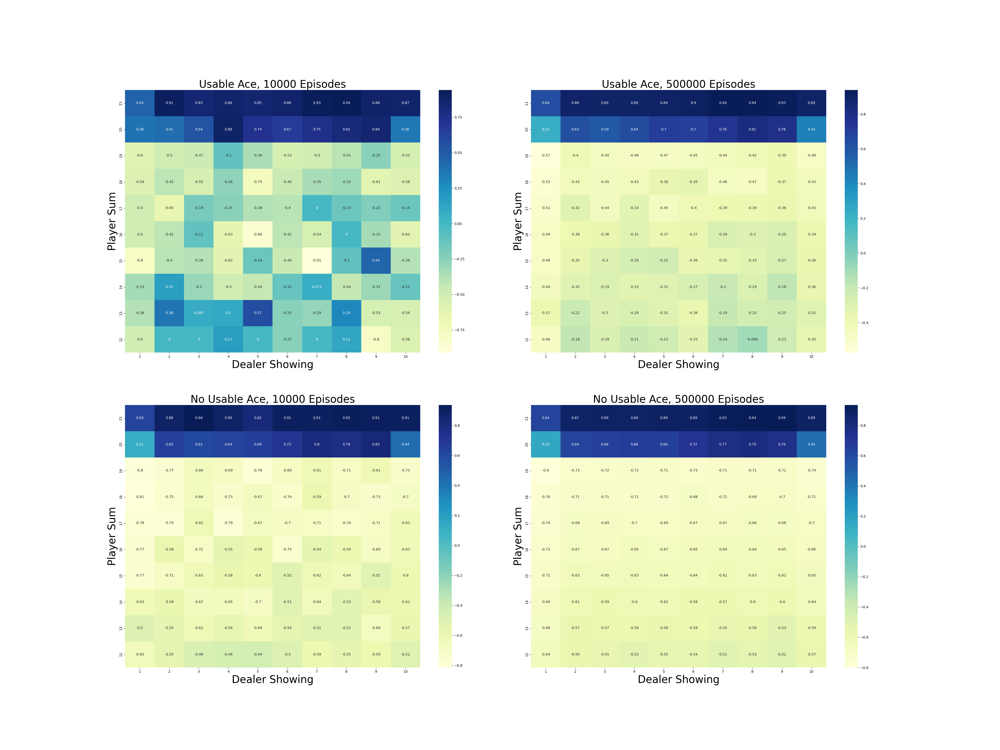

# **Blackjack RL**

This project implements Monte Carlo methods for solving the **Blackjack** environment, based on **Chapter 5: Monte Carlo Methods** from the book **Reinforcement Learning: An Introduction** by **Richard S. Sutton & Andrew G. Barto**.

## **📖 References**
This repository is based on:

- **Reinforcement Learning: An Introduction**  
  **Richard S. Sutton & Andrew G. Barto**  
  _Second Edition, MIT Press, 2018_  
  [Read more](https://www.andrew.cmu.edu/course/10-703/textbook/BartoSutton.pdf)

---

## **📂 Project Structure**
```
blackjack/
│── src/                        # Core implementation
│   ├── black_jack.py           # All logic for Blackjack game and Monte Carlo methods
│── notebooks/                  # Jupyter Notebooks for experimentation
│   ├── black_jack.ipynb
│── book_images/                # Reference images from the book
│   ├── blackjack-card-values.png
│   ├── Figure_5_1.PNG
│   ├── Figure_5_2.PNG
│   ├── Figure_5_3.PNG
│── generated_images/           # Plots generated from simulations
│   ├── figure_5_1.png
│   ├── figure_5_2.png
│   ├── figure_5_3.png
│── README.md                   # Project documentation
```

---

## 📌 Key Features
✅ Implements **Monte Carlo On-Policy**, **Off-Policy**, and **Exploring Starts (ES)** methods for Blackjack  
✅ Simulates games using **target**, **behavior**, and **greedy policies**  
✅ Handles **usable ace** logic and player/dealer behavior accurately  
✅ Clean separation between environment logic and notebook-based experimentation  
✅ Helps develop strong intuition for **model-free reinforcement learning**

---

## 📊 Results and Visualizations

### 1️⃣ **Figures from Sutton's Book**
These figures illustrate the state-value estimates for the Blackjack problem.

📈 **Visualization:**


_(These are taken directly from the book and serve as ground truth references.)_

---

### 2️⃣ **Generated Simulation Results**
These figures show the results of simulations for various Monte Carlo approaches:

📈 **Visualization:**




---

## 🔍 Interpretation of Results

Each visualization provides insight into the learned policy and value function under different Monte Carlo approaches:

- **Figure 5.1 (On-Policy MC):**  
  Shows the state-value function for the target policy where the player sticks at 20 or 21. The plots indicate that having a usable ace generally increases the expected return, especially when the dealer shows a weak card (2–6).

- **Figure 5.2 (Exploring Starts):**  
  Demonstrates the optimal policy learned through exploring starts. The policy reflects aggressive behavior when the player sum is low and the dealer has a high-value card. The learned value function aligns with the optimal strategy shown in Sutton's book.

- **Figure 5.3 (Off-Policy MC):**  
  Displays estimates of the value of a fixed starting state using both **ordinary** and **weighted importance sampling**. The ordinary method shows high variance, while the weighted version stabilizes more quickly, illustrating the advantage of weighted sampling in off-policy learning.

These results verify that Monte Carlo methods can successfully estimate value functions and policies through sampling, even without a model of the environment.

---

## 📢 Conclusion

This project explores **Monte Carlo methods** applied to the **Blackjack environment**:

- Monte Carlo **on-policy**, **off-policy**, and **exploring starts** methods
- Understanding and implementation of **importance sampling**
- Visualization of **value functions** and **policy effectiveness**
- Lays a foundation for exploring **model-free reinforcement learning**

Through these methods, we observe how agents learn optimal strategies in stochastic environments without access to a model.

---
