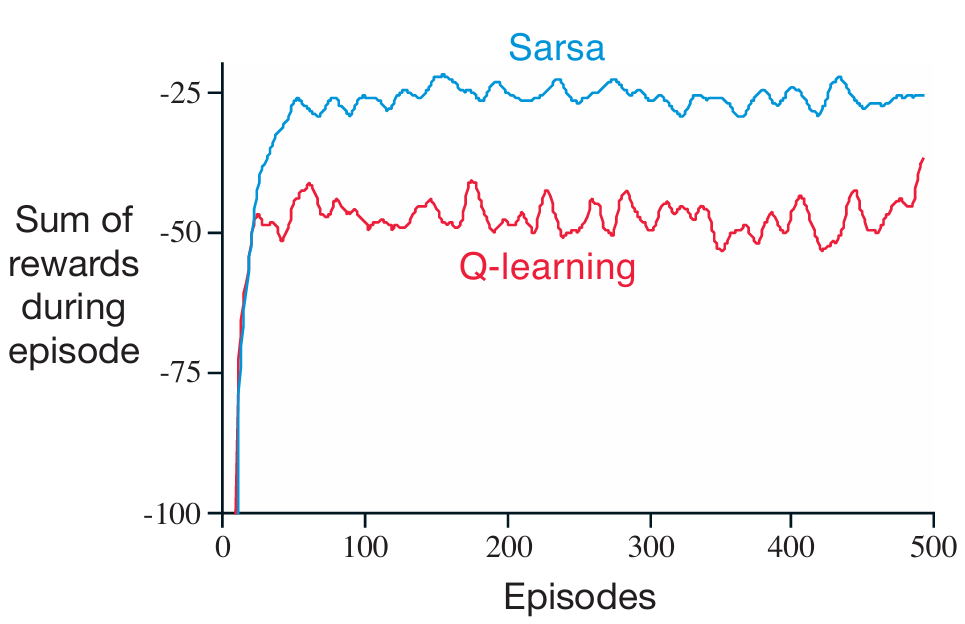
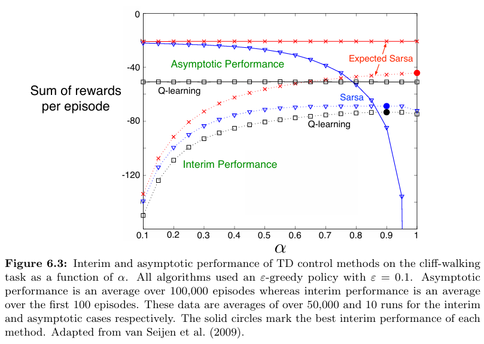
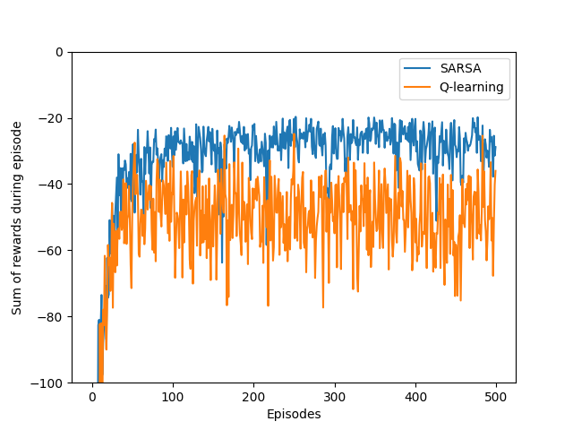
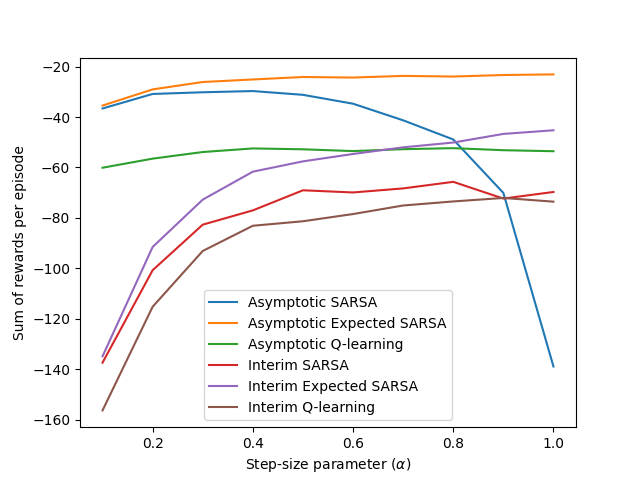

# **Reinforcement Learning: Cliff Walking**

This project implements **SARSA**, **Expected SARSA**, and **Q-Learning** for solving the **Cliff Walking** environment, based on **Chapter 6: Temporal-Difference Learning** from the book **Reinforcement Learning: An Introduction** by **Richard S. Sutton & Andrew G. Barto**.

---

## **📂 Project Structure**
```
cliff-walking/
│── .idea/                         # Project settings
│── book_images/                   # Reference figures from the book
│   ├── Example_6_6_graph.PNG
│   ├── Example_6_6_grid.PNG
│   ├── Figure_6_3.PNG
│── generated_images/              # Generated visualizations
│   ├── example_6_6.png
│   ├── figure_6_3.png
│── notebooks/                     # Jupyter Notebook for experiments
│   ├── cliff_walking.ipynb
│── src/                           # Source code
│   ├── __init__.py
│   ├── cliff_walking.py
│── README.md                      # Project documentation
```

---

## 📌 Key Features

✅ Implements **SARSA**, **Expected SARSA**, and **Q-Learning** algorithms  
✅ Uses an **ε-greedy** policy for exploration  
✅ Handles **cliff transitions** with severe penalties  
✅ Demonstrates the trade-off between **exploration vs. exploitation**  
✅ Includes **optimal policy printing** for visual interpretation

---

## 📊 Results and Visualizations

### 1️⃣ **Figures from Sutton's Book**
These figures illustrate the Cliff Walking task and the comparison between SARSA and Q-learning methods.

📈 **Visualization:**





---

### 2️⃣ **Generated Simulation Results**
These are visualizations produced from this project showing learned policies and performance comparison:

📈 **Visualization:**




---

## 🔍 Interpretation of Results

- **SARSA** learns a conservative path, avoiding the cliff to minimize risk and long-term penalty.  
- **Q-Learning**, being off-policy, tends to learn the shortest risky path, falling off the cliff more frequently.  
- **Expected SARSA** combines both and usually performs more stably across episodes.  
- This difference in learned behavior reflects the **on-policy vs off-policy** learning nature.

---

## 📢 Conclusion

This project demonstrates the core ideas of **Temporal-Difference Learning**:

- Learning value functions from raw experience without models  
- Exploring **SARSA**, **Expected SARSA**, and **Q-Learning** differences  
- Understanding the role of **step-size**, **exploration**, and **update strategy**

It gives powerful insights into how agents learn under risk and uncertainty in reinforcement learning.

---
