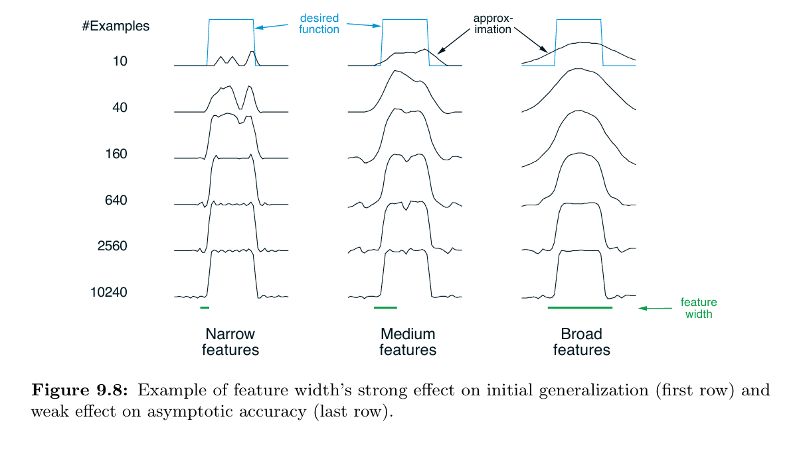
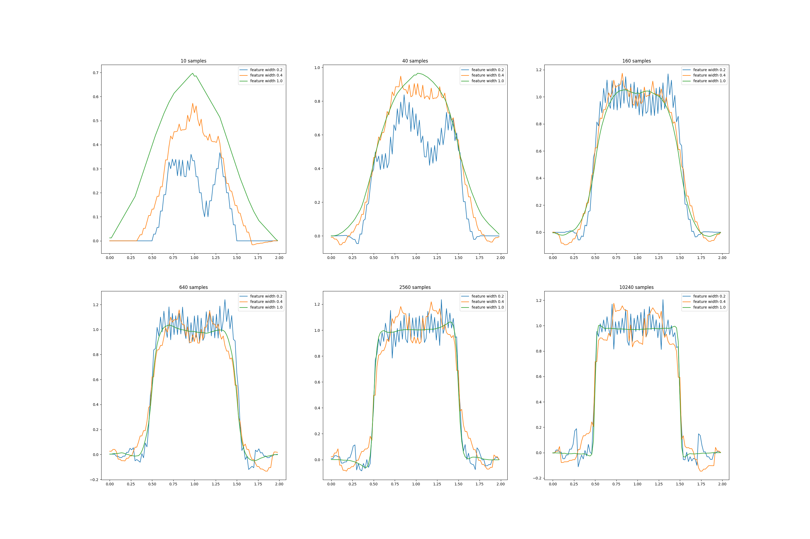

# **Reinforcement Learning: Square Wave with Coarse Coding**

This project demonstrates the effect of **feature width (receptive field size)** in coarse coding for function approximation.  
The experiment learns a one-dimensional square-wave function using a linear approximator, based on **Chapter 9: On-Policy Prediction with Approximation**, specifically **Figure 9.8**, from *Reinforcement Learning: An Introduction* by **Richard S. Sutton** and **Andrew G. Barto**.

---

## 📂 **Project Structure**
```
square-wave/
├── src/
│ ├── classes.py # Helper classes for feature representation and learning logic
│ └── square_wave.py # Core implementation of the square-wave learning experiment
├── notebooks/
│ └── square_wave.ipynb # Interactive notebook for visualization and experimentation
├── book_images/
│ └── Figure_9_8.PNG # Reference figure from Sutton & Barto (2018)
├── generated_images/
│ └── figure_9_8.png # Replicated figure produced by the experiment
└── README.md # Project documentation
```

---

## 📌 **Key Features**
✅ Implements **linear function approximation** using **coarse coding** (overlapping receptive fields).  
✅ Compares learning performance for **three feature widths**: narrow, medium, and broad.  
✅ Visualizes how the learned value function approximates a **discontinuous square-wave** target.  
✅ Reproduces **Sutton’s Figure 9.8**, showing the trade-off between generalization and accuracy.

---

## ⚙️ **Experiment Overview**
The goal is to learn a simple **1D square-wave function** using a linear function approximator with coarse coding.  
The square-wave function provides training targets sampled along the domain.

The key variable is **feature width** — the size of each receptive field.  
All configurations use approximately 50 features spanning the domain:

- **Narrow Features:** Each feature covers a small interval (fine resolution).
- **Medium Features:** Moderate width, balanced generalization.
- **Broad Features:** Large intervals, strong overlap and high generalization.

**Learning Rule:**  
The weights *w* are updated using gradient descent:

**w ← w + α × (U − v̂(S, w)) × ∇ v̂(S, w)**

where *U* is the target square-wave value.

---

## 📊 **Results and Visualizations**

### 1️⃣ **Figure from Sutton’s Book**
Illustrates how different feature widths affect the learned square-wave approximation.

📈 **Reference Figure:**  


---

### 2️⃣ **Generated Simulation Results**
Replicates the textbook experiment, showing the learned value function for each width after training.

📈 **Generated Figure:**  


---

## 🔍 **Interpretation of Results**

- **Narrow Features:**  
  Learning is slow and generalizes poorly. The function is learned only at sampled points, leaving rough gaps elsewhere.

- **Medium Features:**  
  Offers the best trade-off. It generalizes well enough to capture the square wave’s structure while preserving sharp transitions.

- **Broad Features:**  
  Enables rapid early learning due to wide overlap but produces an overly smooth approximation, failing to model discontinuities.

---

## 📢 **Conclusion**
This experiment highlights a key principle of **function approximation**:  
the **degree of generalization**, controlled by feature width, is a critical hyperparameter.

- Too **narrow** ⇒ slow learning, poor generalization (high variance).
- Too **broad** ⇒ smooth but inaccurate approximation (high bias).

An **intermediate width** achieves the best balance, allowing both fast learning and accurate representation — even for discontinuous targets such as the square wave.  
The results reinforce the importance of designing feature representations that balance **bias and variance** in reinforcement-learning systems.

---
