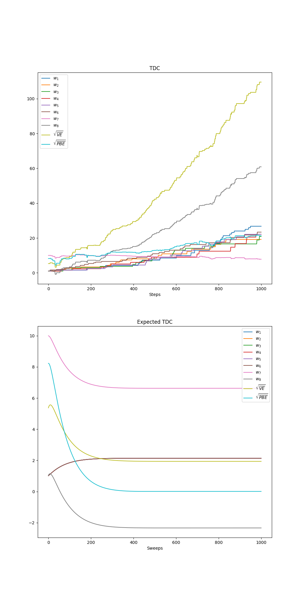

# **Reinforcement Learning: Counter-Examples**

This project implements **Baird’s Counterexample** from **Chapter 11 — Off-policy Methods with Function Approximation** in *Reinforcement Learning: An Introduction* by *Richard S. Sutton & Andrew G. Barto*.  
It demonstrates how **off-policy TD(0)** diverges when used with **linear function approximation**, even in a simple 7-state MDP.

The project includes:

- **Baird’s 7-state star MDP**
- **Semi-gradient off-policy TD(0)** (divergence)
- **Semi-gradient Dynamic Programming (DP)** (stable baseline)
- **Gradient-TD (TDC / GTD(0))**
- **Expected TDC**
- **Expected Emphatic TD (ETD)**
- **RMSVE** and **RMSPBE** evaluation

---

## **📂 Project Structure**
```
counter-examples/
├── book_images/               # Reference figures from Sutton & Barto (Chapter 11)
│   ├── Figure_11_1.PNG        # Baird’s 7-state star diagram
│   ├── Figure_11_2.PNG        # Divergence of off-policy TD(0)
│   ├── Figure_11_5.PNG        # TDC / GTD(0) behavior
│   └── Figure_11_6.PNG        # Emphatic TD behavior
├── generated_images/          # Plots produced from simulation
│   └── figure_11_2.png        # Reproduced RMSVE divergence curve
├── notebooks/                 # Experiment notebooks for different methods
│   ├── bairds_counterexample.ipynb   # Semi-gradient TD divergence experiment
│   ├── emphatic_baird.ipynb          # Expected Emphatic TD implementation
│   └── tdc_baird.ipynb               # TDC / GTD(0) experiments
├── src/
│   └── counter_example.py     # Core implementation of Baird’s counterexample
└── README.md                  # Project documentation

```

---

## ✅ Key Features
- Implements the **canonical 7-state counterexample**
- Shows divergence of **semi-gradient off-policy TD(0)**
- Provides **stable semi-gradient DP** as comparison
- Implements **TDC (GTD(0))**, **Expected TDC**, and **Expected Emphatic TD**
- Computes **RMSVE** and **RMSPBE**
- Reproduces the qualitative behavior in **Figures 11.1–11.6**

---

## 🧩 Baird’s 7-State Counterexample

This minimal MDP reveals a fundamental failure of off-policy TD with linear approximation.

- **Upper states (0–5):**
  - Feature *i* = 2
  - Last feature = 1

- **Lower state (6):**
  - Second-to-last feature = 1
  - Last feature = 2

- **Reward:** always 0
- **True value function:** identically 0
- **Target policy:** always chooses the *solid* action
- **Behavior policy:** chooses *solid* with probability 1/7

This mismatch (off-policy sampling + bootstrapping + function approximation) causes TD to **diverge**.

---

## 🧮 Error Metrics

### **1. RMSVE — Root Mean Square Value Error**

$$
\text{RMSVE} = \sqrt{\sum_s \mu(s) (w^\top x(s))^2}
$$

### **2. RMSPBE — Root Mean Square Projected Bellman Error**

$$
\Pi = F (F^\top D F)^+ F^\top D
$$

---

## 🔄 Semi-gradient TD(0) — Divergence

Implements Sutton’s **Equation (11.2)**:

$$
w \leftarrow w + \alpha \rho \delta x(s)
$$

- Off-policy sampling
- Linear function approximation
- Bootstrapping

---

## 🔁 Semi-Gradient DP — Stable Baseline

Implements **Equation (11.9)**:

- Expected update over all states
- No bootstrapping instability
- Produces stable weight evolution

---

## 🔄 Gradient-TD (TDC / GTD(0))

The TDC update follows the sampling equations from Chapter 11:

- Maintains **primary weights** \( w \)
- Maintains **secondary weights** \( v \)
- Uses **gradient correction** to minimize MSPBE

TDC **converges** on Baird’s counterexample.

---

## 🔄 Expected TDC

Expected TDC computes the **expected update**:

- Loops over all states
- Computes expected TD error
- Updates both \( w \) and \( v \)

Produces smooth and stable convergence.

---

## 🔄 Expected Emphatic TD (ETD)

Expected ETD implements emphatic weighting:

- Updates the **emphasis \( M \)**
- Uses the emphatic TD update rule
- Converges reliably in off-policy settings

---

## 📖 Book Reference Visualizations

### **Figure 11_1 — Baird’s Star Diagram**


### **Figure 11_2 — Off-policy TD Divergence (Book)**


### **Figure 11_5 — TDC Behavior (Book)**


### **Figure 11_6 — Emphatic TD Behavior (Book)**


---

## 🖼️ Generated Visualizations

### **Figure 11_2 — RMSVE Divergence (Reproduced)**


### **Figure 11_5 — TDC Convergence (Reproduced)**


### **Figure 11_6 — Expected ETD Convergence (Reproduced)**


---

## 🔍 Key Observations
- Off-policy TD(0) **diverges**
- Divergence arises from:
  - Function approximation
  - Bootstrapping
  - Off-policy sampling
- TDC, Expected TDC, and ETD all **converge**
- RMSVE and RMSPBE highlight stability differences across methods

---

## 🏁 Conclusion

This project reproduces **Baird’s Counterexample**, demonstrating the instability of **off-policy TD(0)** under linear function approximation.  
It includes stable alternatives such as **TDC**, **Expected TDC**, and **Expected Emphatic TD**, matching the results presented in **Chapter 11** of Sutton & Barto.

