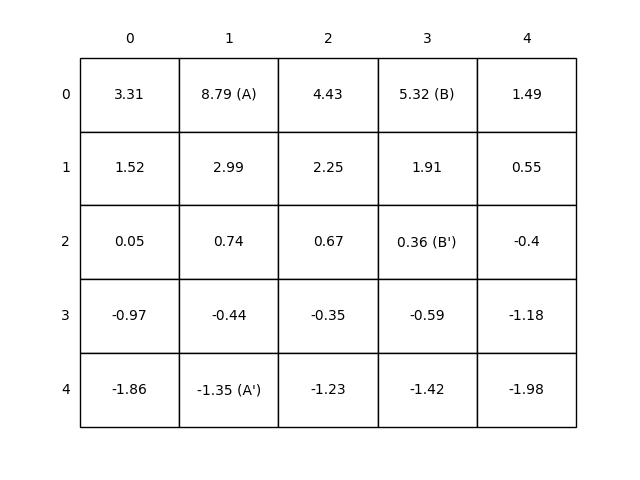
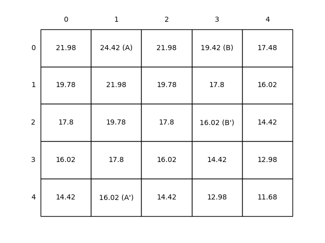

# **Reinforcement Learning: Gridworld MDP**

This project implements the **Gridworld Markov Decision Process (MDP)**, a fundamental environment in **Reinforcement Learning (RL)**. It is inspired by **Chapter 3: Finite Markov Decision Processes** from the book **Reinforcement Learning: An Introduction** by **Richard S. Sutton & Andrew G. Barto**.


---

## **📂 Project Structure**
```
gridworld-mdp/
│── src/                      # Core implementation
│   ├── grid_world.py         # Gridworld MDP implementation
│── notebooks/                # Jupyter Notebooks for experimentation
│   ├── grid_world.ipynb      
│── book_images/              # Reference images from the book
│   ├── Figure_3_2.PNG        # State-value function example from the book
│   ├── Figure_3_5.PNG        # Optimal policy example from the book
│── generated_images/         # Plots generated from simulations
│   ├── figure_3_2.png        # Computed state-value function visualization
│   ├── figure_3_5.png        # Computed policy iteration visualization
│   ├── figure_3_5_policy.png # Computed optimal policy representation
│── __init__.py  
│── README.md                 # Project documentation
```
---

## 📌 Key Features

✅ Implements **Gridworld MDP**, a foundational RL environment.

✅ Demonstrates **state-value functions, policy evaluation, and policy improvement**.

✅ Includes **visualizations** to illustrate **value iteration and policy iteration**.

✅ Supports **different reward structures** and **terminal states**.

✅ Provides **notebooks for step-by-step exploration** of Gridworld concepts.

---

## 📊 Results and Insights

### 1️⃣ **State-Value Function Visualization**
In **Gridworld**, an agent moves in a 2D grid with rewards assigned to different states. The **state-value function** determines how good it is for the agent to be in a given state.

📈 **Example Visualization:**




_This image represents the computed state-value function for the Gridworld MDP._

---

### 2️⃣ **Optimal Policy Representation**
The optimal policy guides the agent towards maximizing cumulative rewards. The **policy iteration algorithm** refines policies iteratively until convergence.

📈 **Example Visualization:**




_This image showcases the computed optimal policy derived from policy iteration._

---

## 📢 Conclusion

This project explores **Markov Decision Processes (MDPs)** in a **Gridworld environment**, demonstrating key RL concepts such as **policy evaluation, policy improvement, and value iteration**.

- **Value Iteration** efficiently finds the optimal policy.
- **Policy Iteration** alternates between policy evaluation and improvement.
- **State-value and action-value functions** guide the agent in decision-making.

By studying **Gridworld**, we build an intuition for **Dynamic Programming (DP)** techniques in Reinforcement Learning, paving the way for **more complex RL environments**.

---

