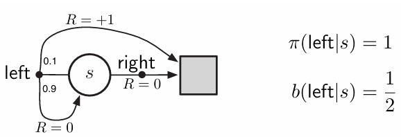

# **Infinite Variance in Off-Policy Evaluation**

This project explores the phenomenon of **infinite variance** in **Monte Carlo off-policy evaluation** using **importance sampling**, based on **Chapter 5: Monte Carlo Methods** from *Reinforcement Learning: An Introduction* by **Richard S. Sutton & Andrew G. Barto**.

---

## 📖 References
This repository is based on:

- **Reinforcement Learning: An Introduction**  
  **Richard S. Sutton & Andrew G. Barto**  
  _Second Edition, MIT Press, 2018_  
  [Read online](https://www.andrew.cmu.edu/course/10-703/textbook/BartoSutton.pdf)

---

## 📂 Project Structure
```
infinite-variance/
│── src/                            # Core simulation code
│   ├── infinite_variance.py
│── notebooks/                      # Jupyter Notebook for experiments
│   ├── infinite_variance.ipynb
│── book_images/                    # Figures from Sutton & Barto
│   ├── Figure_5_4_1.PNG
│   ├── Figure_5_4_2.PNG
│── generated_images/              # Generated result plots
│   ├── figure_5_4.png
│── README.md                      # Project documentation
```

---

## 📌 Key Features

✅ Simulates **off-policy evaluation** via **importance sampling**  
✅ Uses a custom environment with **rare target trajectories**  
✅ Defines clear **target** and **behavior** policies  
✅ Reveals how **importance ratios explode** in long episodes  
✅ Includes visual comparisons with **book figures** and **simulation output**

---

## ⚙️ Environment Description

This environment demonstrates how importance sampling can lead to extreme variance when the behavior and target policies diverge significantly.

- **Actions:** `left` (0) and `right` (1)
- **Target Policy:** Always selects `left`
- **Behavior Policy:** Randomly selects `left` or `right` with equal probability
- **Reward Structure:**
  - Choosing `right` ends the episode with reward = 0
  - Choosing `left` continues the episode with 90% probability, else ends with reward = 1

This structure means the probability of an episode strictly following the target policy drops exponentially with episode length, resulting in **massive importance weights** during evaluation.

---

## 📊 Results and Visualizations

### 1️⃣ **Figures from Sutton's Book**
These reference figures illustrate the instability in off-policy Monte Carlo evaluation.

📈 **Book Visuals:**




---

### 2️⃣ **Generated Simulation Output**
The simulation output replicates the conditions discussed in the book, showing highly unstable value estimates due to exploding variance.

📈 **Generated Plot:**


---

## 🔍 Interpretation of Results

This example clearly shows how importance sampling estimators can be **unbiased but unstable**. In particular:

- Most episodes terminate early due to random `right` selections.
- Rare episodes fully match the target policy, producing **huge importance weights**.
- The estimates swing wildly, demonstrating **high and persistent variance**.

These outcomes support Sutton & Barto’s discussion that ordinary importance sampling can have **infinite variance**, and that more samples **do not guarantee stability**.

---

## 📢 Conclusion

This project illustrates a core challenge in **off-policy learning**:

- **Ordinary importance sampling** can be **theoretically correct** but practically **unusable** due to infinite variance.
- Shows why **weighted importance sampling**, bootstrapping, or variance-reducing techniques are often essential.

By simulating this failure case, we build deeper understanding of when and why Monte Carlo methods may break down—reinforcing the importance of careful algorithm design in reinforcement learning.

---

