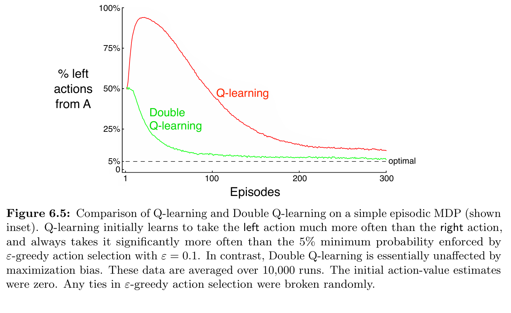

# **Reinforcement Learning: Maximization Bias**

This project implements **Q-learning** and **Double Q-learning** to demonstrate the problem of **maximization bias** in action-value methods. It is based on **Chapter 6: Temporal-Difference Learning**, specifically **Example 6.5**, from the book *Reinforcement Learning: An Introduction* by **Richard S. Sutton & Andrew G. Barto**.

---

## **📂 Project Structure**

```
maximization-bias/
├── src/                          # Core implementation
│   └── maximization_bias.py      # Logic for Q-learning and Double Q-learning
├── notebooks/                    # Jupyter Notebook for experimentation
│   └── maximization_bias.ipynb
├── book_images/                  # Reference figures from the book
│   ├── Figure_6_5_graph.PNG
│   └── Figure_6_5_mdp.PNG
├── generated_images/             # Plots generated from simulations
│   └── figure_6_5.png
└── README.md                     # Project documentation
```


---

## 📌 Key Features
✅ Implements **Q-learning** and **Double Q-learning**  
✅ Demonstrates the **maximization bias problem** in value estimation  
✅ Uses a simple **two-state MDP** to highlight overestimation effects  
✅ Tracks the frequency of “left” actions in **state A** as a performance measure  
✅ Reproduces Sutton’s **Figure 6.5** experiment

---

## ⚙️ **Environment Overview**

- The environment is a **two-state MDP** with the following setup:

    - **States**:
        - `A` (start state)
        - `B` (intermediate)
        - `terminal` (absorbing state)

    - **Actions**:
        - From `A`: two actions → `right` (to terminal) or `left` (to B)
        - From `B`: ten actions, all equivalent, leading to terminal

    - **Rewards**:
        - From `A`: always **0**
        - From `B`: reward sampled from **Normal(μ=-0.1, σ=1.0)**

---

## 🧠 **Learning Algorithms**

### 🔷 Q-learning
- Standard off-policy **action-value learning**.
- Updates based on the maximum estimated value at the next state.
- Suffers from **maximization bias** (systematic overestimation).

### 🔴 Double Q-learning
- Maintains two separate action-value estimates (**Q₁, Q₂**).
- At each step, randomly chooses which one to update.
- Reduces maximization bias by **decoupling action selection and evaluation**.

---

## 📊 Results and Visualizations

### 1️⃣ **Figures from Sutton's Book**
These figures illustrate the theoretical expectation of maximization bias:

📈 **Visualization:**

  
  

---

### 2️⃣ **Generated Simulation Results**
The following results are produced by this implementation:

📈 **Visualization:**

  

This shows how **Q-learning consistently favors the “left” action** in state A (due to maximization bias), whereas **Double Q-learning remains unbiased**.

---

## 🔍 **Key Observations**
- **Q-learning** overestimates action values, leading to a systematic preference for risky choices.
- **Double Q-learning** corrects this bias and learns a more balanced policy.
- The experiment highlights why overestimation is problematic in reinforcement learning and how **Double Q-learning mitigates it**.

---

## 📢 Conclusion
This project provides a hands-on demonstration of:

- **Maximization bias** in Q-learning
- How **Double Q-learning** addresses this issue
- Reproducing **Sutton’s Example 6.5** as a classic benchmark

The Maximization Bias problem is a key example for understanding the **limitations of greedy updates** and the importance of unbiased estimators in RL.  
