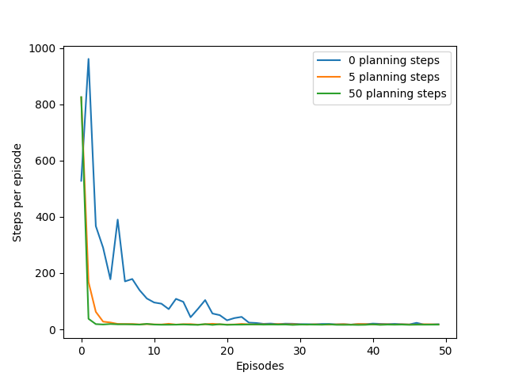
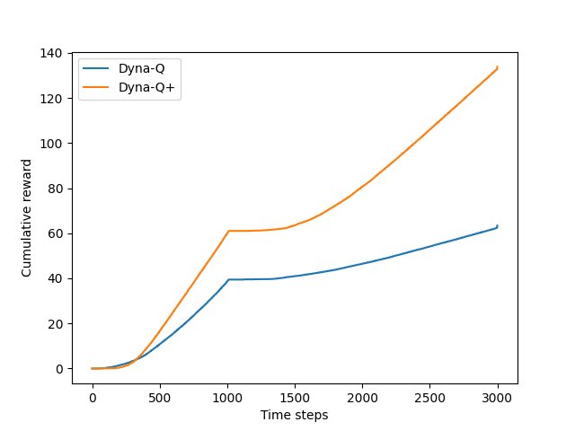
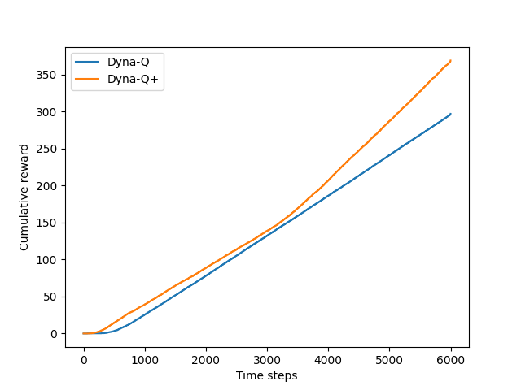
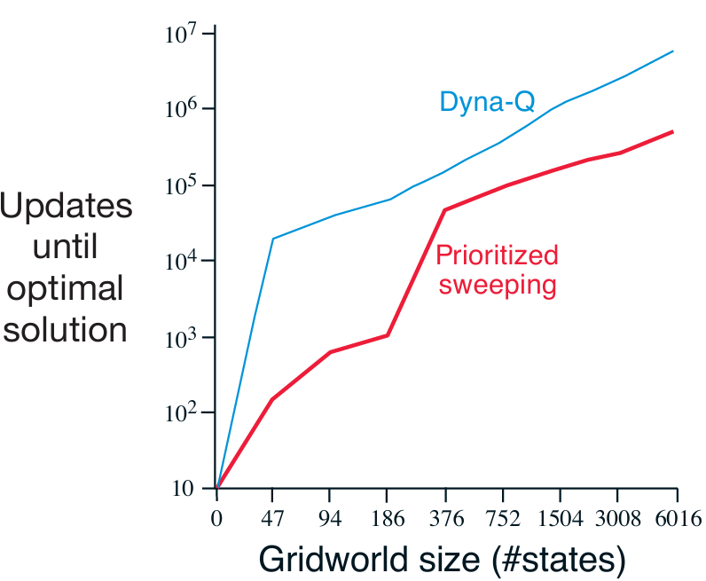
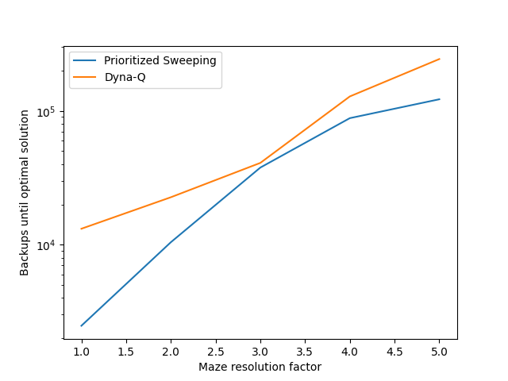

# **Reinforcement Learning: Mazes**

This project implements and analyzes several tabular model-based reinforcement learning methods, including **Dyna-Q**, **Dyna-Q+**, and **Prioritized Sweeping**.  
The experiments are based on **Chapter 8: Planning and Learning with Tabular Methods** from the book *Reinforcement Learning: An Introduction* by **Richard S. Sutton and Andrew G. Barto**.

---

## 📂 **Project Structure**
```
mazes/
├── src/ # Core source code and implementations
│ ├── dyna.py # Contains Dyna-Q, Dyna-Q+, and Prioritized Sweeping algorithms
│ ├── functions.py # Utility functions for environment setup, plotting, and analysis
│ ├── maze.py # Defines the Maze environment and state transitions
│ └── models.py # Implements tabular models used for planning (state-action mappings)
│
├── notebooks/ # Jupyter notebooks for experiments and visualization
│ ├── changing_maze.ipynb # Demonstrates Dyna-Q+ adaptation to changing environments
│ ├── dyna_maze.ipynb # Implements Dyna-Q experiments and comparisons
│ └── prioritized_sweeping.ipynb # Demonstrates Prioritized Sweeping efficiency
│
├── book_images/ # Reference figures from book
│ ├── Example_8_4.PNG
│ ├── Figure_8_2_graph.PNG
│ ├── ... (other book figures used for comparison)
│
├── generated_images/ # Plots generated from simulations and algorithm outputs
│ ├── figure_8_2.png
│ ├── figure_8_4.png
│ ├── figure_8_5.png
│ └── example_8_4.png
│
└── README.md # Project documentation
```


---

## 📌 **Key Features**
✅ Implements the **Tabular Dyna-Q** algorithm for integrating planning and learning.  
✅ Implements **Dyna-Q+** to handle changing environments by encouraging exploration.  
✅ Implements **Prioritized Sweeping** for more efficient planning updates.  
✅ Reproduces experiments from Sutton & Barto, including the **Dyna Maze**, **Blocking Maze**, and **Shortcut Maze**.

---

## ⚙️ **Environment Overview**
- A 2D grid world (default **6x9 maze**) with obstacles.
- The agent can take four actions: **UP, DOWN, LEFT, RIGHT**.
- Actions are deterministic unless blocked by a wall or obstacle.
- The episode ends when the agent reaches the **goal state**.
- **Reward:** +1 for reaching the goal, 0 for all other transitions.

---

## 🧠 **Learning Algorithms**

### 🔷 **Tabular Dyna-Q**
An architecture combining **direct reinforcement learning** (Q-Learning) with **model learning and planning**.

- **Direct RL:** After each real interaction, update Q(S, A) using one-step Q-Learning.
- **Model Learning:** Store each experience tuple (S, A, R, S′) in a tabular model.
- **Planning:** Perform *n* simulated updates by sampling from the model.

---

### 🔴 **Dyna-Q+**
An extension of Dyna-Q for **non-stationary environments**.  
Encourages exploration by adding a **bonus reward** to rarely tried actions.

Reward formula:  
**R + κ × √τ**, where:
- **τ** = time since (S, A) was last visited
- **κ** = small constant controlling exploration weight

---

### ⚫ **Prioritized Sweeping**
A more efficient planning approach focusing updates on **important state-action pairs**.

- Uses a **priority queue** instead of uniform sampling.
- Priority is based on the **absolute TD error**.
- When a state S changes, all its predecessors are added to the queue.
- Allows faster propagation of value updates across the model.

---

## 📊 **Results and Visualizations**

### 1️⃣ **Dyna Maze (Example 8.1)**
Demonstrates how planning steps (n) accelerate learning.  
Agents with more planning steps (e.g., n=5, n=50) learn faster than pure Q-Learning (n=0).

📈 **Book Figures & Generated Results**  
 

---

### 2️⃣ **Blocking Maze (Example 8.2)**
Environment changes after 1,000 steps, blocking a learned path.  
**Dyna-Q+** adapts quickly by exploring, while standard Dyna-Q struggles.

📈 **Book Figures & Generated Results**  
 

---

### 3️⃣ **Shortcut Maze (Example 8.3)**
A shorter path opens after 3,000 steps.  
**Dyna-Q+** discovers and exploits it due to its exploration bonus.

📈 **Book Figures & Generated Results**  
 

---

### 4️⃣ **Prioritized Sweeping (Example 8.4)**
Prioritized Sweeping focuses updates on states with high TD error,  
dramatically improving learning speed over uniform Dyna-Q updates.

📈 **Book Figures & Generated Results**  
 

---

## 🔍 **Interpretation of Results**
- **Dyna-Q:** Even a simple model and a few planning steps greatly accelerate learning.
- **Dyna-Q+:** Balances exploration and exploitation effectively in changing environments.
- **Prioritized Sweeping:** Maximizes learning efficiency by focusing updates on impactful states.

---

## 📢 **Conclusion**
This project provides a practical implementation of **fundamental model-based reinforcement learning algorithms**.  
By replicating Sutton & Barto’s classic maze experiments, it demonstrates the power of combining **learning from experience** with **planning from a learned model**.

These results highlight the trade-offs between various planning strategies and their effectiveness in both **stationary** and **dynamic** environments.

---
