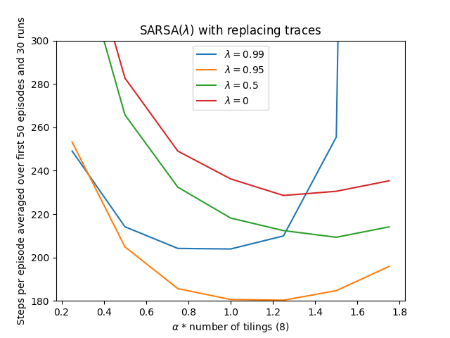
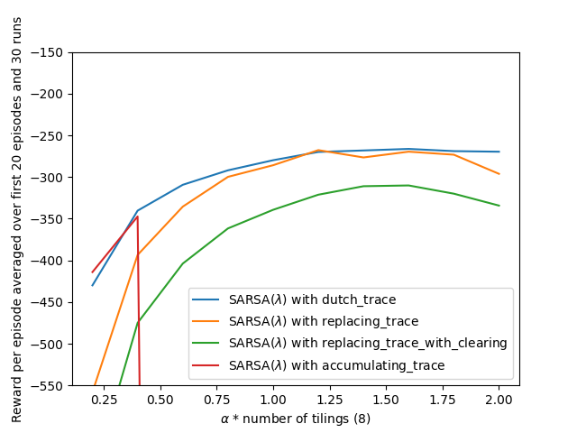

# **Reinforcement Learning: Mountain Car with Eligibility Traces**

This project implements **Sarsa(λ)** with **Tile Coding** to solve the continuous-state **Mountain Car** control problem.  
It reproduces the experiments from **Chapter 12 — Eligibility Traces** of *Reinforcement Learning: An Introduction* by *Richard S. Sutton & Andrew G. Barto*.

This implementation compares different eligibility trace mechanisms:
- **Accumulating Traces**
- **Replacing Traces**
- **Replacing Traces with Clearing**
- **Dutch Traces (True Online)**

---

## **📂 Project Structure**
```
mountain-car-et/
├── book_images/ # Reference figures from Sutton & Barto (Chapter 12)
│ ├── Figure_12_10.PNG # Sarsa(λ) performance with varying λ
│ └── Figure_12_11.PNG # Comparison of trace update types
├── generated_images/ # Plots produced from simulation
│ ├── figure_12_10.png
│ └── figure_12_11.png
├── notebooks/
│ └── mountain_car.ipynb # Experiment notebook
├── src/
│ ├── init.py
│ ├── mountain_car.py # Environment + Sarsa(λ) implementation
│ └── tile_coding.py # Tile coding implementation
└── README.md # Project documentation
```
---

## ✅ Key Features
- Implements **Sarsa(λ)** with linear function approximation (Tile Coding).
- Supports multiple eligibility trace types: **Accumulating, Dutch, Replacing**.
- Reproduces **Figures 12.10 and 12.11** from the book.
- Analyzes the effect of the trace-decay parameter ($\lambda$) and step-size ($\alpha$).

---

## 🎮 Environment: Mountain Car

The environment follows the standard dynamics defined in Sutton & Barto:

| Component | Description |
|---|---|
| **State** | Continuous `(position, velocity)` |
| **Actions** | `{-1: reverse, 0: coast, 1: forward}` |
| **Reward** | -1 per time step until the goal is reached |
| **Boundaries** | Position: $[-1.2, 0.5]$, Velocity: $[-0.07, 0.07]$ |
| **Discount ($\gamma$)** | 1.0 |

The agent must build momentum by driving back and forth to reach the goal at position 0.5.

---

## 📘 Algorithm — Sarsa(λ)

Sarsa(λ) combines the forward view of the $\lambda$-return with the backward view of eligibility traces.

**The weight update rule is:**

$$
w_{t+1} = w_t + \alpha \delta_t e_t
$$

Where:
- $\alpha$ is the step size.
- $\delta_t$ is the TD error: $\delta_t = R_{t+1} + \gamma Q(S_{t+1}, A_{t+1}) - Q(S_t, A_t)$.
- $e_t$ is the eligibility trace vector.

---

## 🧩 Eligibility Trace Types

This project implements four variations of trace updates ($e_t$) found in `src/mountain_car.py`:

### 1. Accumulating Trace
The classical trace update (Eq. 12.5):
$$
e_t = \gamma \lambda e_{t-1} + x(S_t)
$$

### 2. Replacing Trace
Useful for control tasks to avoid trace explosion. Active features are set to 1 (Eq. 12.12):
$$
e_t(i) = \begin{cases} 1 & \text{if } i \in \text{active tiles} \\ \gamma \lambda e_{t-1}(i) & \text{otherwise} \end{cases}
$$

### 3. Replacing Trace with Clearing
When an action is selected, traces corresponding to **non-selected actions** are cleared to zero. This is crucial for state-action traces in control problems.

### 4. Dutch Trace (True Online)
An intermediary between accumulating and replacing traces, used in True Online TD($\lambda$) (Eq. 12.11):
$$
e_t = \gamma \lambda e_{t-1} + x(S_t) - \alpha \gamma \lambda (e_{t-1}^\top x(S_t)) x(S_t)
$$

---

## 📊 Results

| Book Figure | Generated Plot | Description |
|---|---|---|
| **Figure 12.10** | `figure_12_10.png` | Early performance of Sarsa(λ) with Replacing traces vs $\alpha$ and $\lambda$. |
| **Figure 12.11** | `figure_12_11.png` | Comparison of different trace types (Accumulating, Replacing, Dutch). |

---

## 📖 Book Reference Visualizations

### **Figure 12.10 — Sarsa(λ) Performance (Book)**


### **Figure 12.11 — Comparison of Trace Types (Book)**


---

## 🖼️ Generated Visualizations

### **Figure 12.10 — Sarsa(λ) Performance (Reproduced)**


### **Figure 12.11 — Comparison of Trace Types (Reproduced)**


---

## 🔍 Key Observations

- **$\lambda$ Sensitivity (Fig 12.10):** Intermediate values of $\lambda$ (e.g., $\lambda \approx 0.9$) typically result in faster learning than Monte Carlo ($\lambda=1$) or one-step TD ($\lambda=0$).
- **Trace Types (Fig 12.11):**
    - **Accumulating traces** can be unstable for large step sizes ($\alpha$).
    - **Replacing traces** perform better in this control task.
    - **Replacing with clearing** (setting non-selected action traces to 0) provides significant performance benefits in Sarsa.

---

## 🏁 Conclusion

This project demonstrates the efficiency of **Eligibility Traces** in continuous control problems. By reproducing the experiments from **Chapter 12**, we confirm that **Sarsa($\lambda$)** with tile coding significantly accelerates learning compared to $n$-step methods, and that the choice of trace update mechanism (Replacing vs. Accumulating) has a major impact on stability and speed.