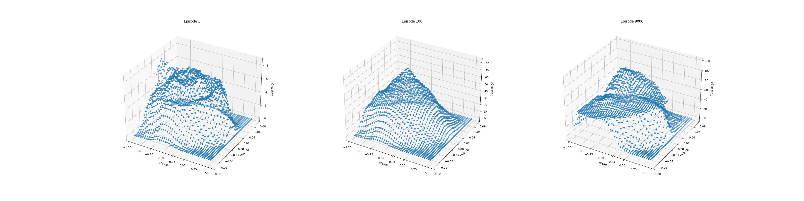
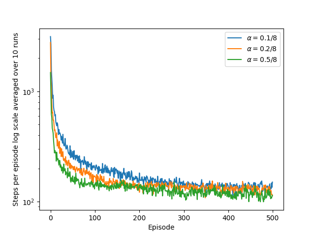
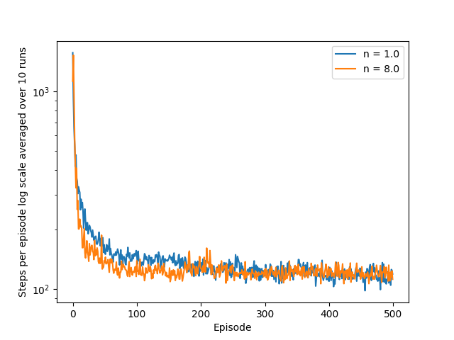
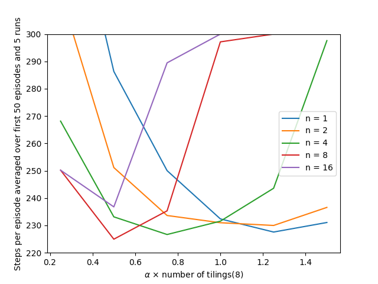

# **Reinforcement Learning: Mountain Car**

This project implements **Semi-gradient n-step Sarsa** with **Tile Coding** to solve the continuous-state **Mountain Car** control problem.  
It reproduces the experiments from **Chapter 10 — Function Approximation** of *Reinforcement Learning: An Introduction* by **Richard S. Sutton & Andrew G. Barto**.
---

## **📂 Project Structure**
```
mountain-car/
├── book_images/ # Reference plots from the Sutton & Barto book
│ ├── Figure_10_1.PNG
│ ├── Figure_10_1_upper_left.PNG
│ ├── Figure_10-2.PNG
│ ├── Figure_10_3.PNG
│ └── Figure_10_4.PNG
├── generated_images/ # Plots produced from simulation
│ ├── figure_10_1.png
│ ├── figure_10_2.png
│ ├── figure_10_3.png
│ └── figure_10_4.png
├── notebooks/
│ └── mountain_car.ipynb # Experiment notebook
├── src/
│ ├── mountain_car.py # Environment + Semi-gradient n-step Sarsa logic
│ └── tile_coding.py # Tile coding implementation
└── README.md # Project documentation
```


---

## ✅ Key Features
- Implements **Semi-gradient n-step Sarsa** for continuous control
- Uses **Tile Coding** for function approximation of \( Q(s, a) \)
- Reproduces the qualitative behavior of **Figures 10.1–10.4** from the book
- Clean separation between **environment**, **value function**, and **learning loop**
- Includes **3D cost-to-go visualization** across training episodes

---

## 🎮 Environment Overview

The agent must drive an underpowered car up a steep hill. Because the engine is too weak to climb directly, the agent must first **move away from the goal** to build momentum.

| Component | Description |
|---------|-------------|
| **State** | Continuous `(position, velocity)` |
| **Actions** | `{-1: reverse, 0: coast, 1: forward}` |
| **Reward** | -1 at each step until goal is reached |
| **Terminal Condition** | `position ≥ 0.5` |

The environment dynamics follow the standard Mountain Car equations and include velocity clipping and reset at the left boundary.

---

## 🧩 Function Approximation with Tile Coding

Because the state space is continuous, the action-value function \( Q(s,a) \) cannot be represented using a table.

We approximate it as:

$$
Q(s, a) = \sum_{i \in \text{active tiles}(s, a)} w_i
$$

Multiple overlapping tilings provide **generalization** while maintaining **local sensitivity**.

- `tile_coding.py` contains a modified version of Sutton’s reference implementation.
- `ValueFunction` scales and encodes `(position, velocity, action)` into active tiles.

---

## 🔄 Semi-gradient n-step Sarsa

The update rule is:

$$
G_t^{(n)} = R_{t+1} + \cdots + R_{t+n} + Q(S_{t+n}, A_{t+n})
$$
$$
w \leftarrow w + \alpha \bigl(G_t^{(n)} - Q(S_t, A_t)\bigr)
$$

Where:
- Increasing `n` smooths estimates and can improve stability
- Smaller `n` updates faster but can introduce higher variance

---

## 📊 Results

| Book Figure | Reproduced Plot   | Interpretation |
|---|-------------------|---|
| **Figure 10.1** | `figure_10_1.png` | Cost-to-go visualization after training |
| **Figure 10.2** | `figure_10_2.png` | Effect of varying number of tilings |
| **Figure 10.3** | `figure_10_3.png` | Learning curves for different `n` values |
| **Figure 10.4** | `figure_10_4.png` | Performance vs. step size comparison |

These results match the **qualitative trends** described in Sutton & Barto.

---

## 🖼️ Generated Visualizations

### Figure 10_1 — Cost-to-Go after Training


### Figure 10_2 — Effect of Varying Number of Tilings


### Figure 10_3 — Learning Curves for Different n


### Figure 10_4 — Performance vs. Step Size


---

## 🔍 Key Observations
- Tile coding enables **effective generalization** across a continuous state space.
- Larger `n` (multi-step backup) results in **smoother** learning but may slow early progress.
- The learned **cost-to-go surface** demonstrates how the agent gains momentum by first driving away from the goal.
- Performance is sensitive to **step size** and number of tilings, consistent with the book.

---

## 🏁 Conclusion

This implementation demonstrates how **function approximation** and **multi-step bootstrapping** interact in continuous control environments.  
It reproduces the canonical Mountain Car experiment from **Chapter 10** of Sutton & Barto and serves as a strong baseline for exploring:

- Eligibility traces (λ-return)
- Actor–critic variants
- Continuous-action policy gradients