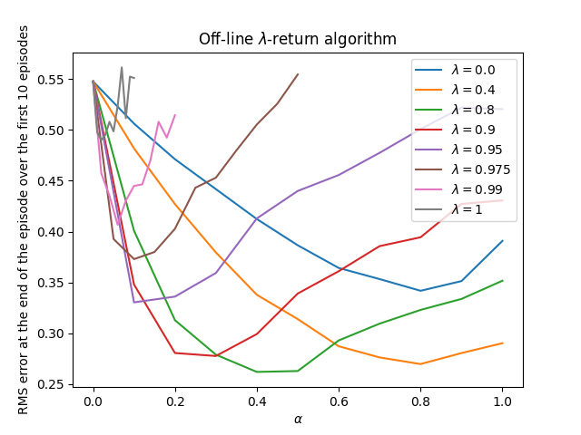
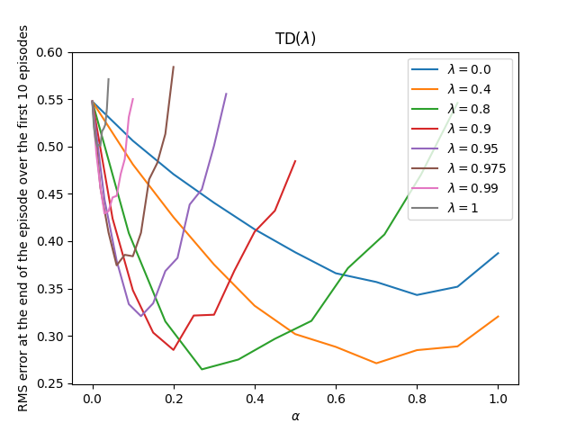
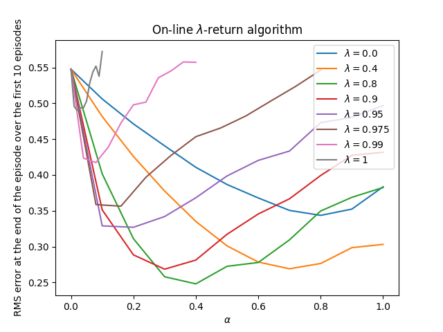

# **Reinforcement Learning: Random Walk with Eligibility Traces**

This project implements three core eligibility-trace methods from **Chapter 12 — Eligibility Traces** in *Reinforcement Learning: An Introduction* by *Richard S. Sutton & Andrew G. Barto*:

- **Off-line λ-return**
- **TD(λ)**
- **True Online TD(λ)**

Each method is evaluated on the **Random Walk** example, reproducing the behavior shown in **Figures 12.3, 12.6, and 12.8** of the book.

---

## **📂 Project Structure**

```
random-walk-et/
├── book_images/ # Reference figures from Sutton & Barto (Chapter 12)
│ ├── Figure_12_3.PNG # Off-line λ-return example
│ ├── Figure_12_6.PNG # TD(λ) forward vs backward view
│ └── Figure_12_8.PNG # True online TD(λ) comparison
├── generated_images/ # Plots produced from simulation
│ ├── figure_12_3.png
│ ├── figure_12_6.png
│ └── figure_12_8.png
├── notebooks/
│ └── random_walk.ipynb # Experiment notebook
├── src/
│ └── random_walk.py # Core implementation of λ-return, TD(λ), True Online TD(λ)
└── README.md # Project documentation
```


---

## **🌱 Environment: Random Walk**

The environment is the standard **5-state Random Walk** from Sutton & Barto:

- States: A–E (non-terminal)
- Terminal states: **Left terminal (0), Right terminal (+1)**
- Actions: implicit movement left or right (taken by the environment)
- Reward:
    - `+1` on transition into the right terminal
    - `0` otherwise

The true value function forms a straight line between the two terminal states.

---

## **📘 Algorithm 1 — Off-line λ-Return**

Off-line λ-return uses the forward-view return:

At time *t*, the λ-return is:

$$
G^\lambda_t = (1-\lambda)\sum_{n=1}^{T-t-1} \lambda^{n-1} G_t^{(n)} + \lambda^{T-t-1} G_t
$$

Where:

$$
G_t^{(n)} = R_{t+1} + \cdots + R_{t+n} + V(S_{t+n})
$$

This method waits until the full episode ends, then performs a **single batch update**:

$$
w \leftarrow w + \alpha \sum_t \bigl( G_t^{(\lambda)} - V(S_t) \bigr)\, x(S_t)
$$


### **Purpose**
- Provides the *forward view* definition of eligibility traces
- Serves as a reference for TD(λ) and True Online TD(λ)

---

## **📘 Algorithm 2 — TD(λ)**

TD(λ) uses **backward-view eligibility traces**, defined by:

**Accumulating trace:**

$$
e_t = \gamma \lambda e_{t-1} + x(S_t)
$$

**TD error:**

$$
\delta_t = R_{t+1} + \gamma V(S_{t+1}) - V(S_t)
$$

**Update rule:**

$$
w_{t+1} = w_t + \alpha \delta_t e_t
$$

### **Forward–Backward Equivalence**
Your implementation reproduces **Figure 12.6**, showing:

- Forward-view λ-return targets
- Backward-view TD(λ) updates
- Their equivalence for Monte Carlo episodes

---

## **📘 Algorithm 3 — True Online TD(λ)**

True Online TD(λ) corrects TD(λ) so that **forward and backward views match exactly at every time step**, not just in expectation.

Key update components:

**Dutch trace:**

$$
e_t = \gamma \lambda e_{t-1} + x(S_t) - \alpha \gamma \lambda (e_{t-1}^\top x(S_t)) x(S_t)
$$

**True-online weight update:**

$$
w_{t+1} = w_t + \alpha \bigl( \delta_t + V(S_t) - V(S_{t-1}) \bigr) e_t - \alpha \bigl( V(S_t) - V(S_{t-1}) \bigr) x(S_t)
$$

### **Purpose**
- Stable and efficient for online learning
- Exactly matches the forward-view target at all times
- Reproduces the behavior in Figure 12.8

---

## **📊 Results**

| Book Figure | Generated Plot | Description |
|-------------|----------------|-------------|
| **Figure 12.3** | `figure_12_3.png` | Off-line λ-return estimates |
| **Figure 12.6** | `figure_12_6.png` | Forward vs backward TD(λ) |
| **Figure 12.8** | `figure_12_8.png` | True online TD(λ) comparison |

---

## **📖 Book Reference Visualizations**

### **Figure 12_3 — Off-line λ-Return (Book)**


### **Figure 12_6 — TD(λ) Forward–Backward Equivalence (Book)**


### **Figure 12_8 — True Online TD(λ) (Book)**


---

## **🖼️ Generated Visualizations**

### **Figure 12_3 — Off-line λ-Return (Reproduced)**


### **Figure 12_6 — TD(λ) (Reproduced)**


### **Figure 12_8 — True Online TD(λ) (Reproduced)**


---

## **🔍 Key Observations**
- Off-line λ-return provides exact forward-view targets
- TD(λ) approximates these targets using backward-view traces
- True Online TD(λ) matches the forward view *exactly* at each step
- Eligibility traces unify Monte Carlo and TD methods
- λ controls the trade-off between bias and variance

---

## **🏁 Conclusion**

This project reproduces the core eligibility-trace algorithms from **Chapter 12** of Sutton & Barto using the Random Walk environment.  
It demonstrates the relationships among **λ-return**, **TD(λ)**, and **True Online TD(λ)**, and reproduces the characteristic results shown in Figures **12.3, 12.6, and 12.8**.

Eligibility traces provide a powerful bridge between **n-step bootstrapping** and **Monte Carlo**, enabling efficient and flexible value estimation methods.

---
