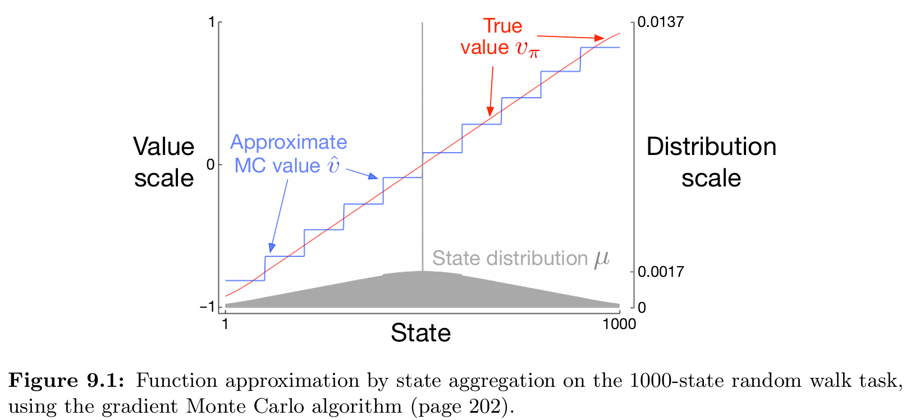
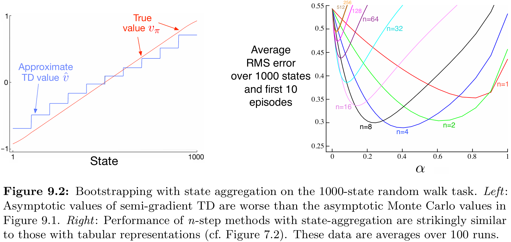
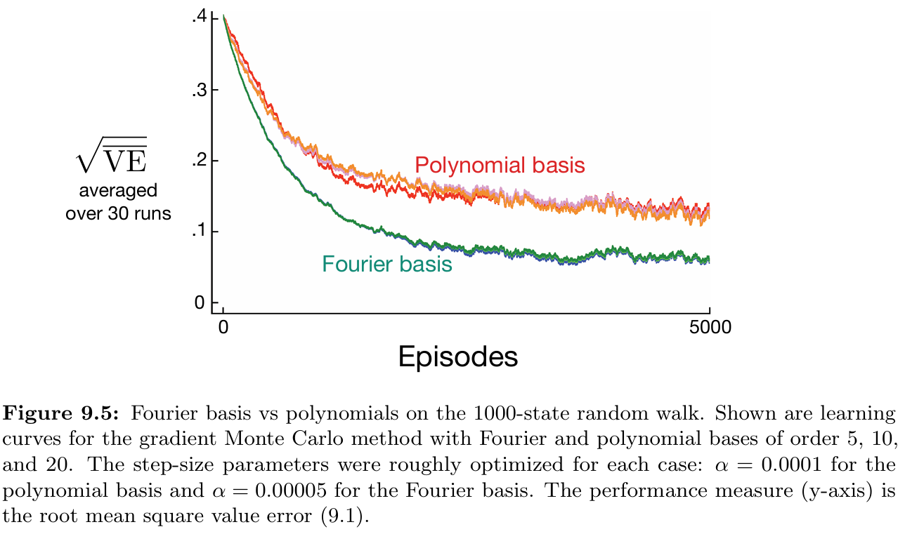
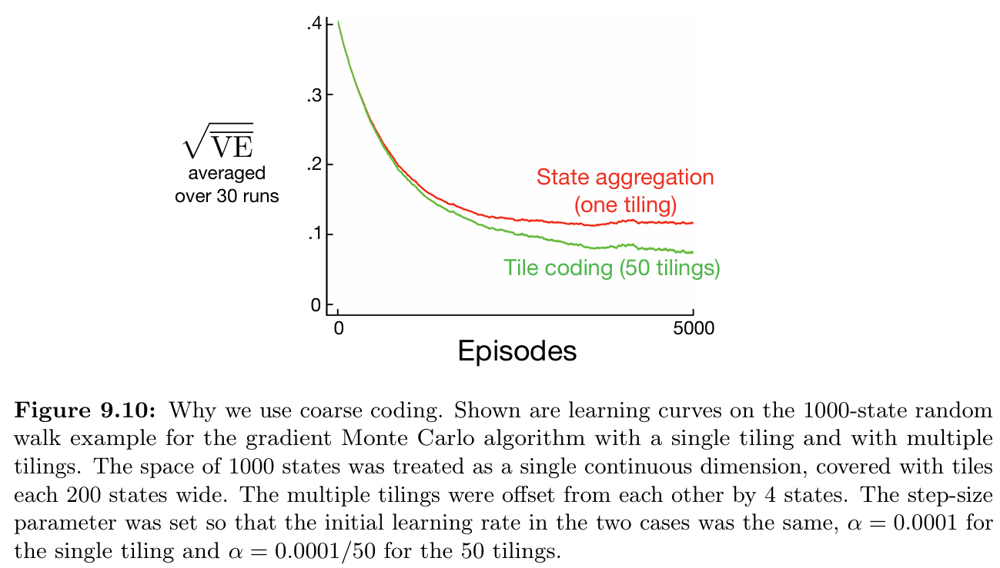
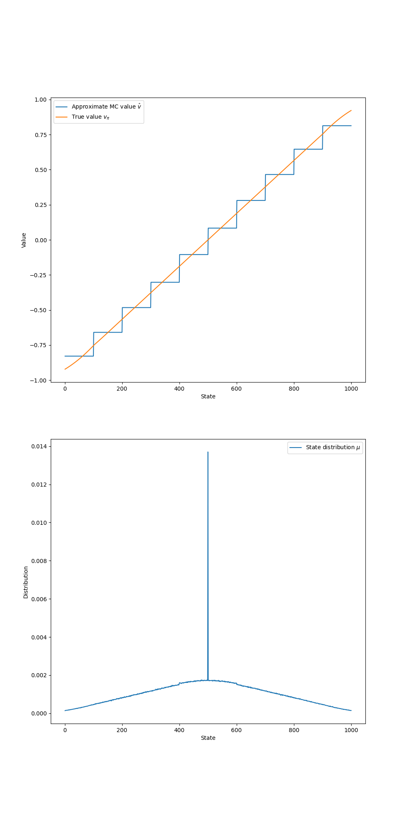
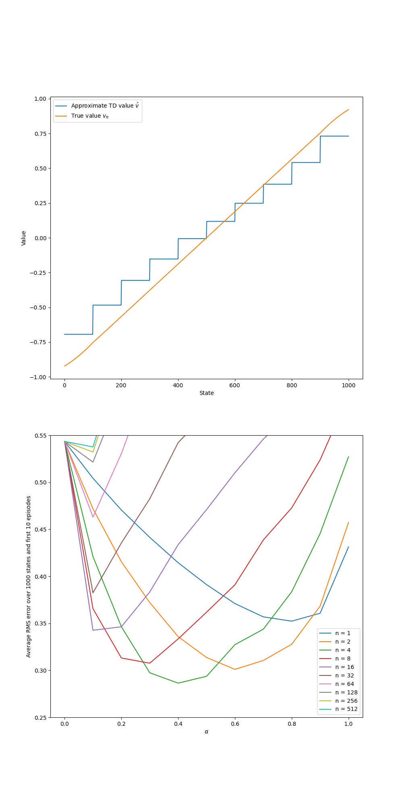
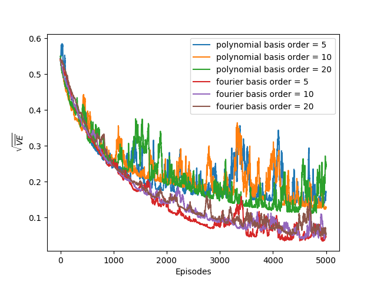
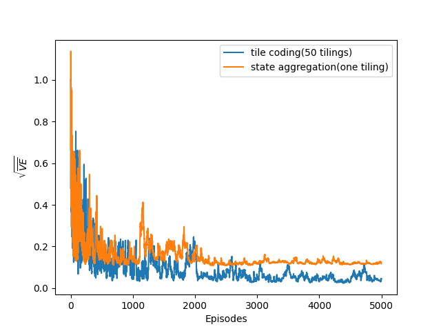

# **Reinforcement Learning: Random Walk with Function Approximation**

This project implements and compares various **function approximation (FA)** methods for solving the **1000-state Random Walk** problem.  
The experiments are based on **Chapter 9: On-Policy Prediction with Approximation** from the book *Reinforcement Learning: An Introduction* by **Richard S. Sutton** and **Andrew G. Barto**.


---

## 📂 **Project Structure**
```
function-approximation/
├── src/
│ └── random_walk.py # Core logic for environment dynamics and function approximation methods
├── notebooks/ # Jupyter Notebooks for experiments and analysis
│ ├── bootstrapping.ipynb
│ ├── polynomials_vs_fourier.ipynb
│ ├── state_aggregation.ipynb
│ └── tile_coding.ipynb
├── book_images/ # Reference figures from Sutton & Barto (Chapter 9)
│ ├── Figure_9_1.PNG
│ ├── Figure_9_2.PNG
│ ├── Figure_9_5.PNG
│ └── Figure_9_10.PNG
├── generated_images/ # Plots generated from simulations
│ ├── figure_9_1.png
│ ├── figure_9_2.png
│ ├── figure_9_5.png
│ └── figure_9_10.png
└── README.md # Project documentation
```

---

## 📌 **Key Features**
✅ Implements the **1000-state continuous Random Walk** environment.  
✅ Compares multiple **function approximation methods**:
- State Aggregation (Gradient MC & Semi-gradient TD)
- Polynomial Basis
- Fourier Basis
- Tile Coding  
  ✅ Evaluates performance using **Root Mean Squared Error (RMSE)** against true state values.  
  ✅ Reproduces **key figures from Chapter 9** of Sutton & Barto, demonstrating each method’s properties.

---

## ⚙️ **Environment Overview**
- **Environment:** Continuous 1D random walk with **1000 states** (numbered 1–1000).
- **Terminal States:** 0 (left) and 1001 (right).
- **Start State:** Always begins at **State 500**.
- **Actions:** Move left or right by a random integer step from {1, 2, …, 100}.
- **Rewards:**
    - +1 for reaching the right terminal state (1001)
    - -1 for reaching the left terminal state (0)
    - 0 for all other transitions

---

## 🧠 **Learning Algorithms & Function Approximators**
This project uses **Gradient Monte Carlo (MC)** and **Semi-gradient TD(0)** to learn an approximate value function **v̂(s, w)**.

### 🔷 **Gradient Monte Carlo (MC)**
Updates weights after each episode completes.  
Equation:  
**w ← w + α × (G − v̂(S, w)) × ∇v̂(S, w)**

### 🔴 **Semi-gradient TD(0)**
Updates weights at each step using bootstrapping.  
Equation:  
**w ← w + α × (R + γv̂(S′, w) − v̂(S, w)) × ∇v̂(S, w)**

---

### ⚙️ **Function Approximation Methods**
Four methods are used to represent the feature vector **x(s)**:

- **State Aggregation:**  
  Groups 1000 states into 10 equal bins of 100 states.  
  Each feature vector is a one-hot encoding of its group.

- **Polynomial Basis:**  
  Represents normalized state position with polynomial features:  
  **x(s) = (1, s, s², …, sⁿ)**

- **Fourier Basis:**  
  Represents state features using cosine terms:  
  **x(s) = (cos(0πs), cos(1πs), …, cos(nπs))**

- **Tile Coding:**  
  Uses multiple overlapping tilings (coarse coding) to produce a sparse binary feature vector, improving generalization.

---

## 📊 **Results and Visualizations**

### 1️⃣ **Figures from Sutton’s Book**
These serve as theoretical baselines for comparison.

📈 **Reference Figures:**  
  
  
  


---

### 2️⃣ **Generated Simulation Results**
Replications of Sutton’s experiments using implemented methods.

📈 **Generated Figures:**  
  
  
  


---

## 🔍 **Interpretation of Results**
- **State Aggregation (Fig. 9.1):**  
  Gradient MC converges to a stepwise approximation of the true value.  
  Lowest error in the middle of groups, highest at boundaries.

- **Bootstrapping (Fig. 9.2):**  
  Semi-gradient TD(0) learns faster but converges to a biased estimate.  
  *n*-step TD methods help balance bias and variance.

- **Polynomial vs. Fourier Basis (Fig. 9.5):**  
  Fourier basis outperforms polynomial.  
  Polynomial features can cause instability due to correlation and large magnitudes.  
  Fourier provides smoother, stable generalization.

- **Tile Coding (Fig. 9.10):**  
  Multiple overlapping tilings yield better learning and generalization.  
  Updates affect neighboring states, accelerating convergence.

---

## 📢 **Conclusion**
This project demonstrates the **strengths and trade-offs** of different function approximation techniques in continuous state spaces.

- **State Aggregation:** Simple but limited representational capacity.
- **TD Bootstrapping:** Faster but introduces bias.
- **Feature Design:** Crucial for stability — Fourier basis > Polynomial.
- **Tile Coding:** Offers powerful and efficient generalization for RL tasks.

These experiments provide practical insight into the principles of **function approximation**, showcasing the importance of representation and learning stability as discussed in **Chapter 9 of Sutton & Barto’s book**.

---
