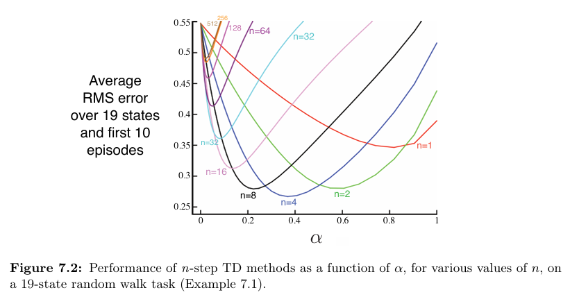
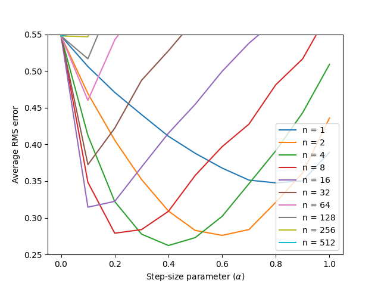

# **Reinforcement Learning: n-step TD on Random Walk**

This project implements **n-step Temporal Difference (TD) methods** for solving the **Random Walk** problem.  
It is based on **Chapter 7: n-step Bootstrapping**, specifically **Example 7.2**, from the book *Reinforcement Learning: An Introduction* by **Richard S. Sutton & Andrew G. Barto**.

---

## **📂 Project Structure**

```
random-walk-ntd/
├── src/ # Core implementation
│ └── random_walk.py # Logic for n-step TD methods
├── notebooks/ # Jupyter Notebook for experimentation
│ └── random_walk.ipynb
├── book_images/ # Reference images from the book
│ ├── Example_6_2_top.PNG
│ └── Figure_7_2.PNG
├── generated_images/ # Plots generated from simulations
│ └── figure_7_2.png
└── README.md # Project documentation
```

---

## 📌 Key Features
✅ Implements **n-step TD prediction** (generalizing TD(0) and Monte Carlo)  
✅ Uses **19-state Random Walk** environment with terminal rewards  
✅ Compares learning performance for different **n-step values**  
✅ Reproduces Sutton’s **Figure 7.2** experiment  
✅ Modular implementation for experimentation in Python or Jupyter

---

## ⚙️ **Environment Overview**

- A **1D Random Walk** with **19 non-terminal states**:
    - Terminal states: `State 0 (Left)` and `State 20 (Right)`
    - Non-terminal states: `States 1–19`
- The agent always starts from **State 10 (middle)**.
- At each step, the agent randomly moves **left or right** with equal probability (p=0.5).
- Rewards:
    - Left terminal (`State 0`) → **-1**
    - Right terminal (`State 20`) → **+1**
    - All other states → **0**

### ✅ **True State Values**
These represent the ground truth (linear ramp between -1 and +1):

```V(s) = -0.9, -0.8, ..., 0.8, 0.9```   for states 1–19

---

## 🧠 **Learning Algorithm: n-step TD**

### 🔷 n-step TD Prediction
- Generalizes between **TD(0)** and **Monte Carlo**:
    - `n = 1` → equivalent to **TD(0)**
    - `n → ∞` → approaches **Monte Carlo**
- Update rule:  
  ```G = R(t+1) + γ * R(t+2) + γ^2 * R(t+3) + ... + γ^(n-1) * R(t+n) + γ^n * V(S(t+n))```
- Balances **bias and variance** depending on `n`.

---

## 📊 Results and Visualizations

### 1️⃣ **Figures from Sutton’s Book**
These show how n-step TD methods converge and compare:

📈 **Visualization:**  
  


---

### 2️⃣ **Generated Simulation Results**
Simulation outputs from this implementation:

📈 **Visualization:**  


These demonstrate how varying **n** affects convergence speed and accuracy.

---

## 🔍 **Key Observations**
- **Smaller n (e.g., 1-step TD)** → more biased but faster updates.
- **Larger n** → less bias, higher variance.
- Intermediate values of `n` provide a **tradeoff** between speed and stability.
- Reproduces Sutton’s results, validating the implementation.

---

## 📢 Conclusion
This project demonstrates:

- How **n-step TD** bridges the gap between **TD(0)** and **Monte Carlo**.
- The impact of **n** on learning speed, stability, and variance.
- A faithful reproduction of **Sutton’s Example 7.2** with hands-on code.

The Random Walk with n-step TD is a fundamental experiment for understanding **bootstrapping, variance, and bias tradeoffs** in reinforcement learning.  
