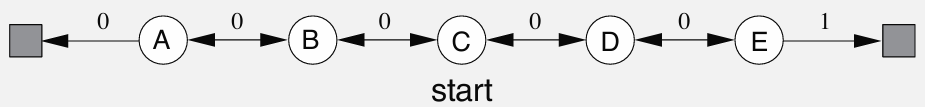
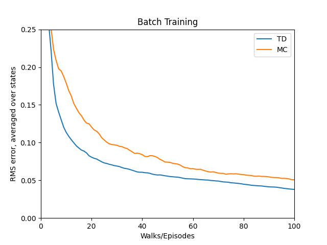
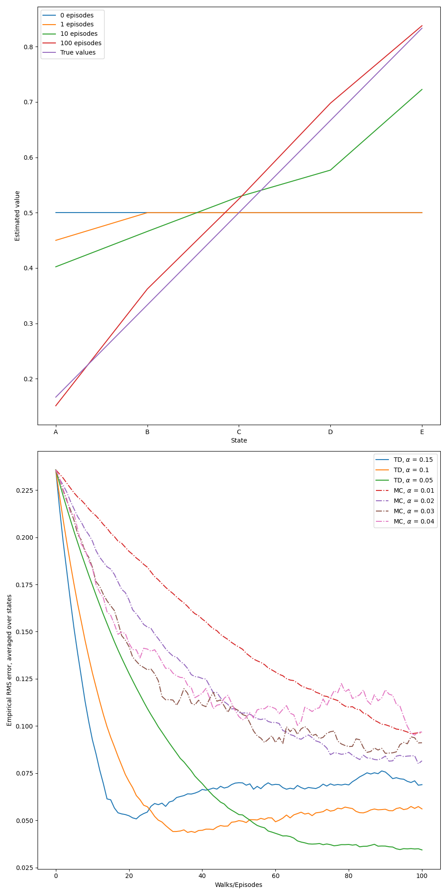

# **Reinforcement Learning: Random Walk**

This project implements **Monte Carlo (MC)** and **Temporal-Difference (TD(0))** learning for solving the **Random Walk** problem, based on **Chapter 6: Temporal-Difference Learning**, specifically **Example 6.2**, from the book **Reinforcement Learning: An Introduction** by **Richard S. Sutton & Andrew G. Barto**.


---

## **📂 Project Structure**
```
random_walk/
├── src/                        # Core implementation
│   └── random_walk.py          # Logic for MC, TD(0), and batch RMSE evaluation
├── notebooks/                  # Jupyter Notebook for experimentation
│   └── random_walk.ipynb
├── book_images/                # Reference images from the book
│   ├── Example_6_2_top.PNG
│   ├── Example_6_2_bottom.PNG
│   └── Figure_6_2.PNG
├── generated_images/           # Plots generated from simulations
│   ├── example_6_2.png
│   └── figure_6_2.png
└── README.md                   # Project documentation
```

---

## 📌 Key Features
✅ Implements **Monte Carlo** and **Temporal-Difference (TD(0))** learning algorithms  
✅ Supports **batch mode** updates until convergence  
✅ Measures **RMSE** to compare learning methods against true values  
✅ Reproduces Sutton’s **Figure 6.2** experiment with high fidelity  
✅ Modular implementation suitable for further RL experimentation

---
## ⚙️ **Environment Overview**

- A **1D grid world** with **7 states**:
  - Terminal: `State 0 (Left), State 6 (Right)`
  - Non-terminal: `States 1–5 (A–E)`
- The agent starts from **State 3 (C)**.
- Each step, the agent randomly moves **left or right** with equal probability (p=0.5).
- The episode ends when the agent reaches a terminal state.
  - `State 6` gives reward **+1**
  - `State 0` gives reward **0**

### ✅ **True State Values**
These represent the ground truth:
```
V(A)=1/6, V(B)=2/6, V(C)=3/6, V(D)=4/6, V(E)=5/6
```

---

## 🧠 **Learning Algorithms**

### 🔷 Monte Carlo Prediction (MC)
- Updates state-values **after the episode ends**
- Uses the full return (final reward) for updates
- Equation:
  ```
  V(S) ← V(S) + α * (G - V(S))
  ```

### 🔴 Temporal-Difference Learning (TD(0))
- Updates **during the episode**, step-by-step
- Uses **bootstrapping** (estimates next state's value)
- Equation:
  ```
  V(S) ← V(S) + α * (R + V(S') - V(S))
  ```

### ⚫ Batch Mode
- Collects multiple episodes before updating
- Iteratively updates all visited states from stored episodes until total change in values falls below a defined threshold (θ)
- Used to compare **TD vs MC** learning behavior on identical data

---
## 📊 Results and Visualizations

### 1️⃣ **Figures from Sutton's Book**
These figures illustrate the expected value predictions and comparisons:

📈 **Visualization:**





_These serve as theoretical reference baselines._

---

### 2️⃣ **Generated Simulation Results**
The following are results of simulated MC and TD(0) learning:

📈 **Visualization:**




These show how both methods evolve value predictions and their accuracy relative to ground truth.

---

## 🔍 **Key Observations**

- **TD(0)** converges faster due to bootstrapping, offering lower variance but potential bias.
- **Monte Carlo** produces unbiased value estimates with higher variance.
- In **batch mode**, TD and MC converge to different fixed points—mirroring Sutton’s original Figure 6.2.
- This confirms key RL concepts such as the **bias-variance trade-off** in value estimation.

---

## 📢 Conclusion

This project offers a hands-on implementation of:

- **Monte Carlo** and **TD(0)** learning for policy evaluation
- Analyzing learning speed, stability, and estimation accuracy
- Replicating classic results from Sutton & Barto’s textbook

The Random Walk problem is an excellent first step for understanding **value prediction** using **model-free reinforcement learning**.

---
