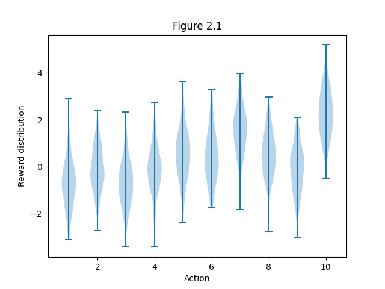
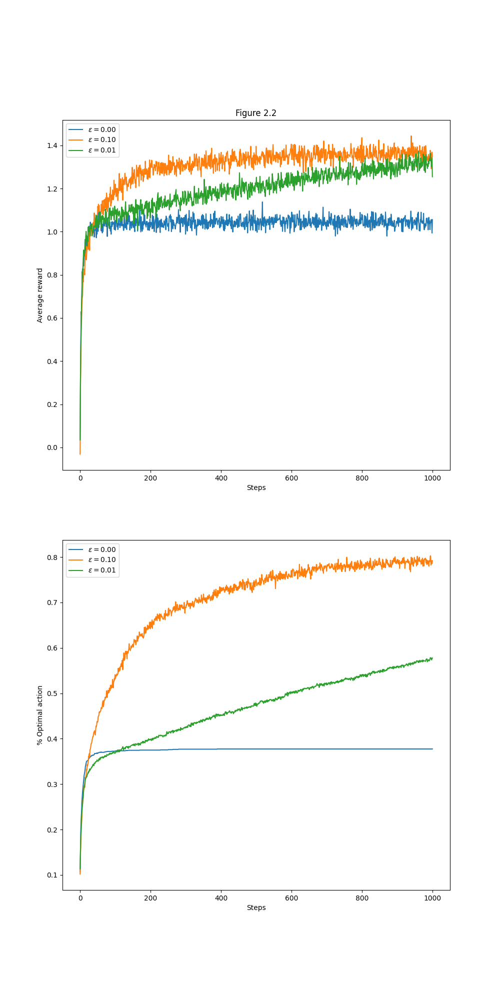
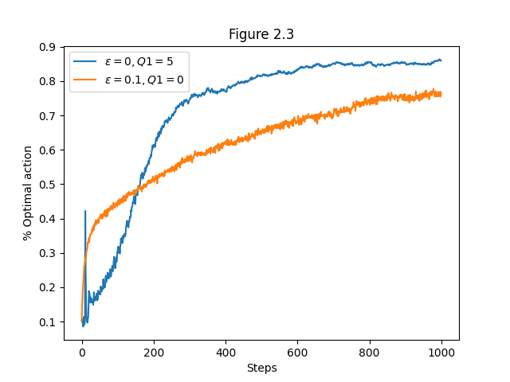
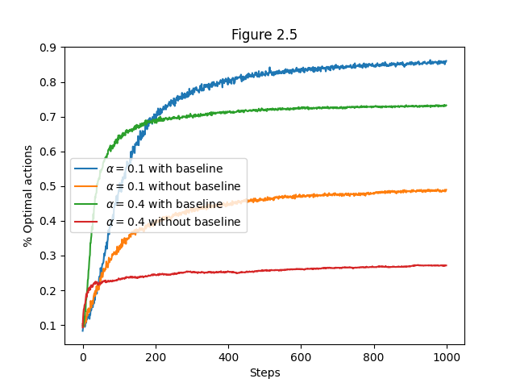
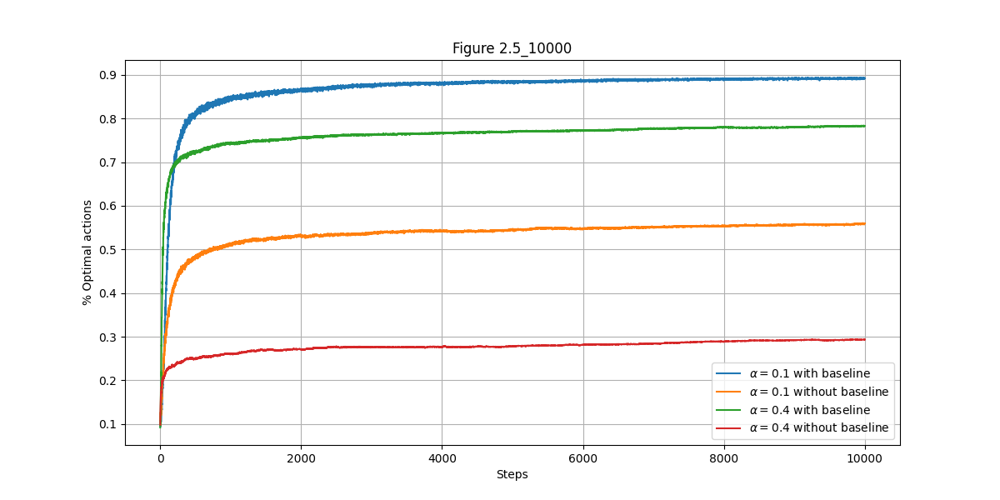

# **Reinforcement Learning: Multi-Armed Bandit: Ten-Armed Testbed**  

This project models the **k-armed bandit problem**, exploring various action selection strategies to optimize reward learning. The implementation includes flexible exploration methods, incremental action-value estimation, and high-resolution visualizations.

## **📖 References**  

This repository is inspired by:  

- **Reinforcement Learning: An Introduction**  
  **Richard S. Sutton & Andrew G. Barto**  
  _Second Edition, MIT Press, 2018_  
  [Read more](https://www.andrew.cmu.edu/course/10-703/textbook/BartoSutton.pdf)  

---  

## **📂 Project Structure**  
```
Ten-Armed-Testbed/
│── src/                      # Core implementation
│   ├── bandit.py             
│   ├── __init__.py  
│── notebooks/                # Jupyter Notebooks for experimentation
│   ├── ten_armed_testbed.ipynb
│── generated_images/         # Saved plots from simulations
│   ├── figure_2_1.png
│   ├── figure_2_2.png
│   ├── figure_2_3.png
│   ├── figure_2_4.png
│   ├── figure_2_5.png
│   ├── figure_2_5_10000_steps.png
│── requirements.txt          # Dependencies
│── README.md                 # Project documentation
```

---

## 📌 Key Features

✅ Models the **k-armed bandit problem**, simulating environments with multiple actions of unknown reward distributions.  
✅ Provides **flexible exploration strategies**, including ε-greedy, Upper-Confidence-Bound (UCB), and gradient bandit methods.  
✅ Supports **sample-average** and **constant step-size** approaches for **incremental action-value estimation**.  
✅ Generates **high-resolution plots** illustrating learning performance, including **average rewards** and **optimal action selection rates** over time.  
✅ Implements **optimistic initial values** to encourage exploration and **UCB-based action selection** for adaptive exploration.  

---

## 📊 Results and Insights

### 1️⃣ Reward Distribution
In the **k-armed bandit problem**, each action has an **unknown true reward**, modeled as a stationary distribution. The optimal strategy should learn these reward values over time.

- Each bandit's reward distribution is **independent** and follows a **normal pattern**.
- The agent **estimates action values** and refines them based on observed rewards.
- Different learning strategies affect **how quickly and accurately** the optimal action is identified.

### 📈 **Plot:** 



---

### 2️⃣ Greedy Action Selection VS ε-greedy Action Selection

**Exploration vs. Exploitation:**  
- **Greedy selection (ε = 0.00):** Always selects the action with the highest estimated value but fails in stochastic environments due to lack of exploration.  
- **ε-greedy selection (ε > 0.00):** With probability ε, a random action is chosen, ensuring occasional exploration.  
- **Higher ε (ε = 0.10):** Encourages exploration early, finding better actions faster but sacrificing long-term stability.  
- **Lower ε (ε = 0.01):** Balances exploration and exploitation, leading to better long-term convergence.  

✅ **Optimal Strategy:** A small, nonzero ε (e.g., **ε = 0.01**) achieves the best balance between exploration and long-term performance.

### 📈 **Plot:** 



---

### 3️⃣ Optimistic Initial Values VS Realistic Initial Values
A common way to encourage exploration **without ε-greedy randomness** is using **optimistic initial estimates** for action values.

- **Optimistic Initial Values:** Assumes **higher-than-expected** rewards, forcing early exploration.
- **Realistic Initial Values:** Starts conservatively, relying on **ε-greedy or UCB** for exploration.
- **Key Insight:** In **stationary environments**, optimistic initial values promote better early exploration but **converge similarly** to ε-greedy over time.
- **Limitation:** In **non-stationary environments**, optimistic initialization is ineffective because the agent stops exploring once high estimates are corrected.

### 📈 **Plot:** 



---

### 4️⃣ Upper-Confidence-Bound (UCB) Action Selection
Instead of exploring randomly, **UCB-based methods** select actions based on their **estimated value** and **uncertainty**.

#### **Key Observations:**
- **UCB prioritizes exploration based on confidence intervals**, reducing unnecessary exploration of suboptimal actions.
- **In stationary environments,** UCB **outperforms ε-greedy** by selecting actions **more systematically**.
- **In non-stationary environments,** UCB may struggle if action values change over time.
- The **exploration term** ensures actions with fewer selections are revisited more frequently early on.

✅ **Conclusion:** UCB **efficiently balances exploration and exploitation**, making it a superior choice in many cases.

### 📈 **Plot:** 


---

### 5️⃣ Gradient Bandit Algorithms (GBA)
Unlike value-based methods, **Gradient Bandit Algorithms** focus on learning **preferences** rather than explicit action values.

### 📈 **Plot:** 



#### **Key Insights:**
- **Policy-Based Approach:** Uses **softmax probabilities** instead of maintaining action-value estimates.
- **With Reward Baseline:** More **stable learning**, adjusting preferences based on relative rather than absolute rewards.
- **Without Reward Baseline:** Slower convergence, as the agent lacks a reference for reward comparison.
- **Performs well in non-stationary environments**, where traditional value-estimation methods struggle.

✅ **Conclusion:**  Gradient Bandit methods are especially effective when rewards depend on probability distributions rather than fixed values. Initially, I assumed that a 10,000-step plot would confirm that the difference between 0.1 with baseline and without baseline would diminish over time. However, after running the experiment, I realized that while this trend holds, continuing to experiment beyond this point provides little additional insight. Additionally, a 10,000-step plot is included, revealing that the difference between 0.1 with baseline and without baseline becomes negligible over longer runs, making further experimentation unnecessary.

### 📈 **Plot:** 



---

## 📢 Conclusion

This project explores **several action selection strategies** for the **k-armed bandit problem**, comparing their effectiveness in balancing **exploration and exploitation**.

- **ε-Greedy ensures exploration** but is **random** and inefficient.
- **Optimistic Initial Values encourage early exploration** but fail in non-stationary settings.
- **UCB dynamically adjusts exploration**, outperforming ε-greedy in many cases.
- **Gradient Bandit methods** are useful when **probability-based action selection** is required.

By **analyzing reward distributions, action selection methods, and long-term performance**, this project highlights the strengths and weaknesses of different **reinforcement learning strategies** in decision-making problems.

---

