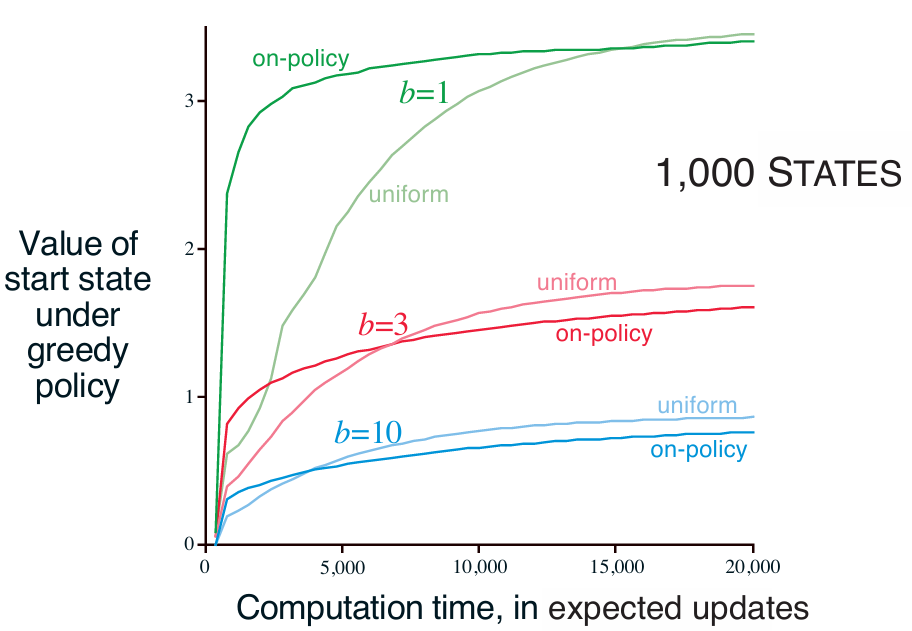
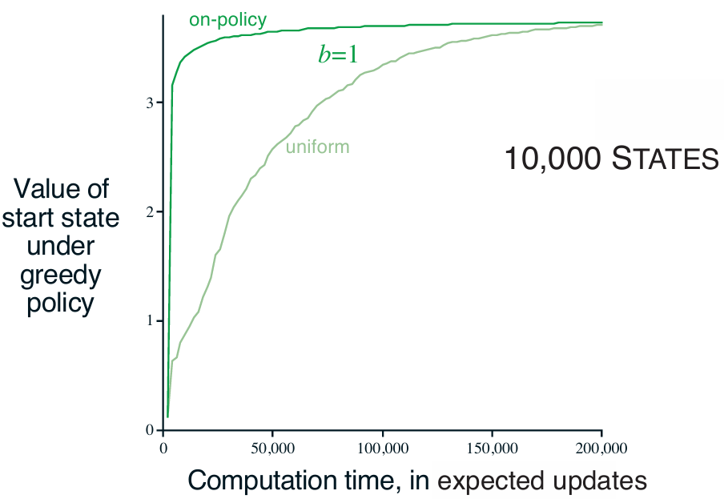
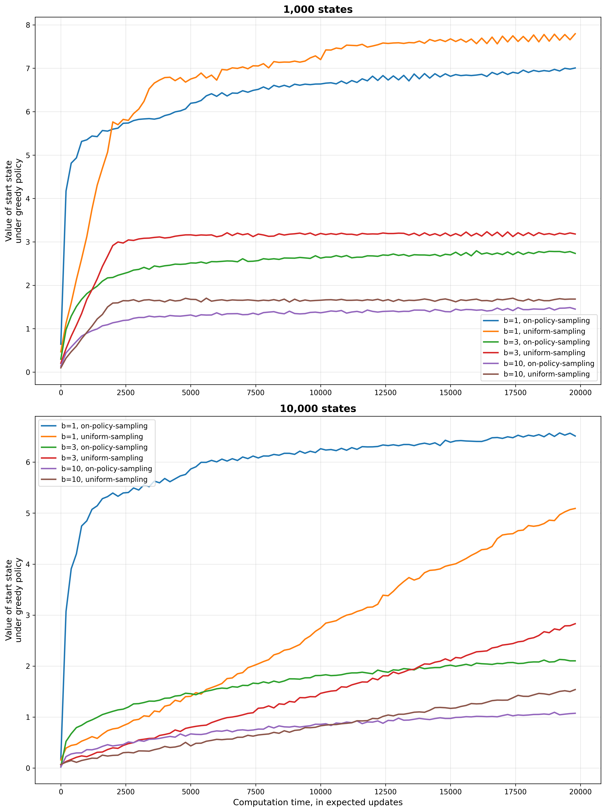

# **Reinforcement Learning: Trajectory Sampling**

This project analyzes **trajectory sampling** as a method for distributing updates in model-based reinforcement learning.  
The experiment compares the performance of **uniform** vs. **on-policy** update distributions, based on **Chapter 8: Planning and Learning with Tabular Methods**, specifically **Figure 8.8**, from the book *Reinforcement Learning: An Introduction* by **Richard S. Sutton** and **Andrew G. Barto**.

---

## 📂 **Project Structure**
```
trajectory-sampling/
├── src/
│ └── trajectory_sampling.py # Core implementation of uniform vs. on-policy update strategies
├── notebooks/
│ └── trajectory_sampling.ipynb # Jupyter notebook for running and visualizing experiments
├── book_images/ # Reference figures from Sutton & Barto (Chapter 8)
│ ├── Figure_8_8_1.PNG
│ └── Figure_8_8_2.PNG
├── generated_images/ # Plots generated from the simulation
│ └── figure_8_8.png
└── README.md # Project documentation
```

---

## 📌 **Key Features**
✅ Implements and compares **uniform** and **on-policy** update distributions for planning.  
✅ Uses **expected updates** to isolate the impact of the sampling strategy.  
✅ Evaluates **policy quality** by measuring the true value of the start state.  
✅ Reproduces Sutton’s **Figure 8.8** experiment across various state-space sizes and branching factors (*b*).  
✅ Demonstrates the trade-off between **focused (on-policy)** and **exhaustive (uniform)** update strategies.

---

## ⚙️ **Experiment Overview**
This experiment investigates how the **distribution of updates** affects planning efficiency.  
It compares two main strategies for selecting which state-action pairs to update:

- **Uniform Sampling:**  
  Systematically cycles through every state-action pair and applies an expected update.  
  Ensures equal coverage across the entire state-action space.

- **On-Policy Sampling (Trajectory Sampling):**  
  Simulates episodes using the current ε-greedy policy, updating only the pairs encountered along these trajectories.  
  Focuses computational effort on states **relevant to the current policy**.

The experiment is conducted on randomly generated MDPs with configurable **state counts** and **branching factors (b)**.

---

## 🧠 **Update Mechanisms**

### 🔷 **Uniform Updates**
The planning process sweeps through **all state-action pairs**, applying one-step expected updates uniformly.  
While comprehensive, this method may waste computation on **irrelevant or unreachable states** under the current policy.

---

### 🔴 **On-Policy (Trajectory) Updates**
Trajectory sampling simulates **episodes** using the model and current policy.  
Planning updates are applied **only** to state-action pairs visited during these simulated trajectories.  
This focuses updates on **currently important states**, leading to faster short-term learning.

---

## 📊 **Results and Visualizations**

### 1️⃣ **Figures from Sutton’s Book**
Theoretical comparison of uniform vs. on-policy sampling across various branching factors and state-space sizes.

📈 **Reference Figures:**  
  


---

### 2️⃣ **Generated Simulation Results**
This simulation replicates the same analysis, showing the **value of the start state** under the greedy policy as a function of computation time (measured in expected updates).

📈 **Generated Figure:**  


---

## 🔍 **Interpretation of Results**

- **Initial Performance:**  
  On-policy (trajectory) sampling achieves **faster early improvements**, as it focuses updates on reachable states relevant to the current policy.

- **Long-Term Performance:**  
  Over time, **uniform sampling** overtakes on-policy methods because it ensures **global convergence** by updating all state-action pairs.

- **Effect of Branching Factor (b):**  
  The **advantage of trajectory sampling** is more pronounced for smaller *b*, where on-policy trajectories cover a larger fraction of transitions.  
  As *b* increases, this advantage diminishes since each trajectory touches fewer of the total possible transitions.

---

## 📢 **Conclusion**
This project highlights a core trade-off in planning:  
the balance between **focused (on-policy)** and **comprehensive (uniform)** update distributions.

- **Trajectory Sampling:**  
  Fast and effective for **early policy improvement**, ideal when computational resources are limited.

- **Uniform Sampling:**  
  More systematic, ensuring **eventual convergence** to the optimal policy by covering the entire state-action space.

The results confirm Sutton & Barto’s insight — that **on-policy sampling accelerates early learning**, while **uniform updates dominate in the long term**, providing a balanced perspective on planning efficiency in model-based reinforcement learning.

---
