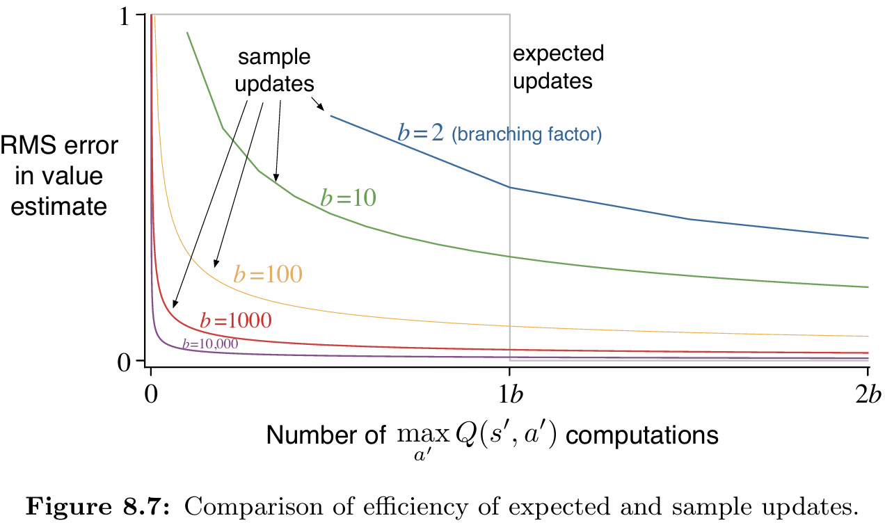
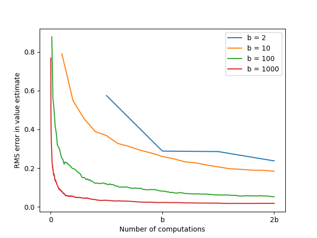

# **Reinforcement Learning: Updates Comparison**

This project provides a comparative analysis of **expected updates** and **sample updates** in model-based reinforcement learning.  
The experiment is based on **Chapter 8: Planning and Learning with Tabular Methods**, specifically **Figure 8.7**, from the book *Reinforcement Learning: An Introduction* by **Richard S. Sutton** and **Andrew G. Barto**.

---


## 📂 **Project Structure**
```
updates-comparison/
├── src/
│ └── expectation_vs_sample.py # Core implementation of expected vs. sample update experiment
├── notebooks/
│ └── expectation_vs_sample.ipynb # Notebook for running and visualizing the experiment
├── book_images/
│ └── Figure_8_7.PNG # Reference figure from Sutton & Barto (Chapter 8)
├── generated_images/
│ └── figure_8_7.png # Reproduced figure from simulation results
└── README.md # Project documentation
```

---

## 📌 **Key Features**
✅ Compares the computational efficiency of **expected updates** vs. **sample updates**.  
✅ Analyzes the **reduction in RMS error** as a function of computation time and branching factor (*b*).  
✅ Reproduces **Figure 8.7** from Sutton & Barto’s textbook.  
✅ Demonstrates why **sample updates** are more practical in large state-action spaces.

---

## ⚙️ **Experiment Overview**
The experiment investigates the question:

> *Given a fixed amount of computation, is it better to perform a few expensive expected updates or many cheaper sample updates?*

- **Branching Factor (b):** Number of possible next states from a given state-action pair.
- **Expected Update:** Computes over all *b* next states — cost proportional to *b*.
- **Sample Update:** Samples one of the *b* next states — cost proportional to *1*.
- **Error Metric:** Root Mean Square (RMS) error between the estimated and true state values.

---

## 🧠 **Update Mechanisms**

### 🔷 **Expected Update**
Computes the value of a state-action pair by considering **all possible next states** and rewards.
- Eliminates sampling error in a single, computationally expensive step.
- After one expected update (cost = *b*), the error ideally drops to zero.
- Represents the **theoretical optimum** but scales poorly with *b*.

---

### 🔴 **Sample Update**
Improves value estimates using **a single sampled transition** from the model.
- Each update is fast but less accurate individually.
- The error after *t* sample updates is approximately proportional to  
  **√((b − 1) / (b × t))**.
- Enables frequent, lightweight updates across many states.

---

## 📊 **Results and Visualizations**

### 1️⃣ **Figure from Sutton’s Book**
Shows the theoretical comparison of RMS error reduction versus computation time for different branching factors.

📈 **Reference Figure:**  

---

### 2️⃣ **Generated Simulation Results**
Reproduces Sutton’s analysis using code simulation.  
Displays the average RMS error (over 100 runs) for branching factors of **2**, **10**, **100**, and **1000**.

📈 **Generated Figure:**  


---

## 🔍 **Interpretation of Results**
- For any given computation amount **less than the branching factor (*b*)**, performing that many **sample updates** reduces error much faster than a single expected update.
- As *b* increases (e.g., *b = 1000*), even a small portion of the expected update cost allows sample updates to **dramatically reduce error**.
- This shows that **sample updates** are far more **efficient and scalable** in large environments, where iterating over all transitions is infeasible.

---

## 📢 **Conclusion**
This project replicates and extends the analysis from Sutton & Barto’s textbook, confirming that **sample updates** generally outperform **expected updates** when computational resources are limited.

While expected updates are theoretically optimal for a single state-action pair, the **efficiency and generality of sample updates** make them the superior choice for large-scale, real-world reinforcement learning problems.

These findings highlight why **sample-based planning** underlies most modern RL algorithms.

---
