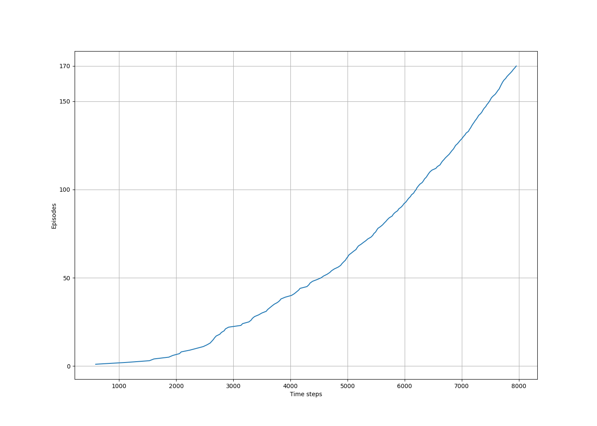

# **Reinforcement Learning: Windy Gridworld**

This project implements the **SARSA (State-Action-Reward-State-Action)** algorithm to solve the **Windy Gridworld** problem, as presented in **Chapter 6: Temporal-Difference Learning**, specifically **Example 6.5**, from the book **Reinforcement Learning: An Introduction** by **Richard S. Sutton & Andrew G. Barto**.


---

## **📂 Project Structure**
```
windy-gridworld/
├── src/                            # Core implementation
│   └── windy_grid_world.py         # Windy Gridworld logic and SARSA learning
├── notebooks/                      # Jupyter Notebook for running experiments
│   └── windy_grid_world.ipynb
├── book_images/                    # Reference images from the book
│   ├── Example_6_5_graph.PNG
│   └── Example_6_5_inset.PNG
├── generated_images/               # Plots generated from experiments
│   └── example_6_5.png
└── README.md                       # Project documentation
```

---

## 📌 Key Features
✅ Implements **SARSA** for learning action-value estimates  
✅ Uses **ε-greedy** strategy for action selection  
✅ Handles **wind** dynamics in a gridworld environment  
✅ Tracks number of steps per episode until reaching goal  
✅ Reproduces Sutton’s **Example 6.5** setting with adjustable parameters

---

## ⚙️ **Environment Overview**

- A **7×10 grid world** with wind affecting vertical movement:
    - The **wind strength** varies per column and pushes the agent **upward**.
    - Stronger wind moves the agent higher in the grid.
- The agent starts at **(3, 0)** and aims to reach the goal at **(3, 7)**.
- **Available actions**: up, down, left, right
- **Wind strength** by column:
  ```
  [0, 0, 0, 1, 1, 1, 2, 2, 1, 0]
  ```
- Every step gives a reward of **−1**, encouraging faster paths.

---

## 🧠 **Learning Algorithm**

### 🔷 SARSA (On-policy TD Control)
- Updates **action-value estimates** based on actual policy followed.
- Learns **Q(s, a)** values while following an ε-greedy policy.
- **Update Rule (Equation 6.7)**:
  ```
  Q(S, A) ← Q(S, A) + α * [R + γ * Q(S', A') − Q(S, A)]
  ```
- Incorporates:
    - **Exploration probability (ε):** 0.1
    - **Step size (α):** 0.5
    - **Discount factor (γ):** 1.0

---

## 📊 Results and Visualizations

### 1️⃣ **Figures from Sutton's Book**
Visual illustrations of the Windy Gridworld setup and results:

📈 **Reference Visuals:**


---

### 2️⃣ **Generated Results**
Simulated outcomes based on the current implementation:

📈 **Simulation Output:**



This shows the **number of time steps per episode** as the agent learns to reach the goal more efficiently over time.

---

## 🔍 **Key Observations**

- The agent learns to reach the goal more efficiently as episodes progress.
- Wind dynamics introduce additional complexity, requiring the agent to learn compensatory actions.
- The ε-greedy strategy ensures continued exploration to avoid local optima.

---

## 📢 Conclusion

This project demonstrates:

- On-policy control using **SARSA**
- The influence of environmental dynamics (wind) on agent behavior
- Application of foundational **TD learning techniques** in a gridworld setting

Windy Gridworld serves as an essential example in understanding **action-value learning** and the balance between **exploration and exploitation** in reinforcement learning.

---
